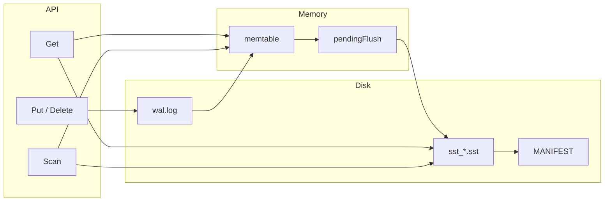

# PebbleDB

I built PebbleDB from scratch in Go to learn how a real log-structured merge tree handles durability, recovery, and concurrent reads. It is my own code — not a fork of RocksDB or CockroachDB's Pebble.

**Status:** educational embedded engine with real crash recovery and race-tested compaction. I do not claim production readiness.

[Full documentation →](docs/README.md)

---

## Why I built this

I wanted to understand storage engines by implementing one layer at a time: WAL, memtable, SSTable, manifest, compaction, recovery. Reading papers and existing code was not enough — I needed to hit the bugs myself (WAL replay duplicating flushed data, manifest/memory ordering, compaction races).

---

## Architecture



Details: [docs/architecture/SYSTEM_OVERVIEW.md](docs/architecture/SYSTEM_OVERVIEW.md) · [diagrams/](docs/diagrams/)

---

## Capabilities

| Area | Supported |
|------|-----------|
| Write path | Group commit WAL, optional `SyncWrites`, memtable flush |
| Read path | Layered Get, per-SST bloom filters, optional block cache |
| Range scan | Merge iterator, tombstone filtering, snapshot isolation |
| Compaction | Size-tiered oldest-2 merge |
| Recovery | Manifest-driven SST load, `wal.flush` replay offset, orphan quarantine |
| Concurrency | Concurrent Get/Scan; single writer; `go test -race` in CI |
| Crash testing | Subprocess crash points at flush/compaction boundaries |
| CLI | `put`, `get`, `delete`, `scan`, `sync` |

**Not included:** replication, transactions, MVCC, SQL, network server.

---

## Quick start

```bash
go build -o pebbledb ./cmd/pebbledb

./pebbledb put hello world
./pebbledb sync          # durability barrier after async puts
./pebbledb get hello

./pebbledb -sync-writes put durable value   # fsync per write
./pebbledb scan
```

Go library:

```go
database, _ := db.Open(db.Options{Dir: "./data"})
defer database.Close()
database.Put([]byte("k"), []byte("v"))
database.Sync() // if using default async writes
```

---

## Testing highlights

```bash
go test ./... -race
go test ./internal/db -run Crash -v
```

CI (Linux + macOS): vet, lint, `-race -shuffle=on` full suite.

Strategy: [docs/testing/TESTING_STRATEGY.md](docs/testing/TESTING_STRATEGY.md)

---

## Benchmarks

```bash
go test -bench=. -benchmem -count=1 ./internal/db
```

Default write benches use async group commit — not per-key fsync. See [docs/benchmarks/METHODOLOGY.md](docs/benchmarks/METHODOLOGY.md).

---

## Repository map

```
cmd/pebbledb/       CLI
internal/db/        orchestration, workers, recovery
internal/wal/       write-ahead log
internal/memtable/  skip list + snapshot
internal/sstable/   immutable sorted files
internal/manifest/  live SST set log
internal/iterator/  merge iterator
internal/bloom/     bloom filters
docs/               engineering documentation
```

---

## Documentation index

| Topic | Link |
|-------|------|
| System overview | [docs/architecture/SYSTEM_OVERVIEW.md](docs/architecture/SYSTEM_OVERVIEW.md) |
| Write / read / recovery | [docs/architecture/](docs/architecture/) |
| Design decisions | [docs/design/DECISIONS.md](docs/design/DECISIONS.md) |
| Evolution story | [docs/design/EVOLUTION.md](docs/design/EVOLUTION.md) |
| Postmortems (real bugs) | [docs/postmortems/](docs/postmortems/) |
| Testing | [docs/testing/](docs/testing/) |
| Benchmarks | [docs/benchmarks/](docs/benchmarks/) |

---

## Project limits

- One process per database directory (`LOCK` file)
- Scan copies memtable at creation — memory cost on large memtables
- Oldest-2 compaction — read amplification grows with data
- Iterator does not see data flushed after `Scan()` returns

---

## License

MIT — see [LICENSE](LICENSE).
