# PebbleDB

I built PebbleDB as a from-scratch LSM-tree key-value store in Go. The name is a nod to CockroachDB's Pebble and RocksDB, but this is my own educational implementation — not a fork, not a wrapper around an existing engine. Every layer (WAL, memtable, SSTable, manifest, compaction, merge iterator, CLI) is code I wrote and iterated on until the behaviour matched what I expected from a real log-structured merge tree.

This document explains why I made the architectural choices I did, how each piece works, what features exist today, and how to build and run the project yourself.

---

## Table of Contents

1. [What PebbleDB Is](#what-pebbledb-is)
2. [Why I Chose an LSM Tree](#why-i-chose-an-lsm-tree)
3. [Iterative Design Thought Process](#iterative-design-thought-process)
4. [High-Level Architecture](#high-level-architecture)
5. [On-Disk Layout](#on-disk-layout)
6. [Package Structure](#package-structure)
7. [Feature Catalogue](#feature-catalogue)
8. [Write Path (Put / Delete)](#write-path-put--delete)
9. [Read Path (Get)](#read-path-get)
10. [Range Scan](#range-scan)
11. [Memtable (Skip List)](#memtable-skip-list)
12. [Write-Ahead Log (WAL)](#write-ahead-log-wal)
13. [SSTable Format](#sstable-format)
14. [Bloom Filter](#bloom-filter)
15. [Background Flush](#background-flush)
16. [Background Compaction](#background-compaction)
17. [Manifest](#manifest)
18. [Crash Recovery and wal.flush](#crash-recovery-and-walflush)
19. [Open and Close](#open-and-close)
20. [Concurrency Model](#concurrency-model)
21. [Background Error Policy](#background-error-policy)
22. [CLI](#cli)
23. [Trade-offs](#trade-offs)
24. [Configuration Defaults](#configuration-defaults)
25. [Building and Running](#building-and-running)
26. [Running Tests](#running-tests)
27. [Project Status and Known Limits](#project-status-and-known-limits)

---

## What PebbleDB Is

PebbleDB is a single-node, embedded key-value database. You point it at a directory on disk, call `Put`, `Get`, `Delete`, and `Scan`, and it persists data across process restarts.

It supports:

- Byte-slice keys and values (lexicographic ordering)
- Tombstone-based deletion
- Crash recovery via WAL replay and manifest tracking
- Background flush of in-memory data to immutable SSTables
- Background compaction of SSTables to reduce file count
- Range scans with merge semantics (newest key wins, tombstones hidden)
- A small CLI for manual testing

It does **not** support transactions, replication, column families, snapshots with MVCC, or a network server. I deliberately kept scope tight so I could understand every line.

---

## Why I Chose an LSM Tree

I considered three families of storage engines:

| Approach | Why I did not pick it (for this project) |
|----------|------------------------------------------|
| B-tree (e.g. BoltDB, SQLite page model) | Random write amplification on disk; harder to teach append-only durability |
| Hash table + periodic snapshot | No efficient range scan; full rewrite on save |
| LSM tree (WAL + memtable + SST) | Append-friendly writes, immutable SST files, natural leveled growth |

The LSM model maps cleanly to how I wanted to learn durability:

1. Append to a log first (WAL).
2. Batch into memory (memtable).
3. Flush immutable sorted runs (SSTables).
4. Merge runs in the background (compaction).

That sequence became the backbone of PebbleDB.

---

## Iterative Design Thought Process

I did not design everything upfront. The architecture emerged in layers, and several early decisions were wrong until I fixed them.

### Phase 1: Single memtable + WAL

I started with the smallest possible loop: `Open` creates a WAL and a skip list, `Put` appends to WAL then memtable, `Get` reads memtable only. This proved the WAL record format and skip list API.

### Phase 2: SSTable flush

Once in-memory data needed to survive beyond RAM, I added SSTable flush. Early mistake: I flushed without a manifest. On reopen I globbed `sst_*.sst` files, which broke when orphan files existed. I introduced the manifest to track the **live set** explicitly.

### Phase 3: Reads across layers

`Get` initially only checked the active memtable. I extended the lookup order to: active, then immutable flush queue, then SSTables newest-first. This mirrors production LSMs.

### Phase 4: Tombstones

Deletes are tombstone entries, not physical removal. I had to thread tombstones through memtable, SSTable writer, merge iterator, and compaction. `Scan` hides tombstones; `Get` returns `ErrNotFound` when the newest entry is a tombstone.

### Phase 5: Bloom filter

Linear scan of every SST block on every `Get` was too slow once files grew. I added a per-SSTable bloom filter in the footer. `MayContain` skips whole files when the key definitely is not present.

### Phase 6: Compaction

With only flush, SST file count grew without bound. I added a background compactor that merges the two oldest SSTables when the live count reaches a threshold. Compaction uses the same merge logic as scan but keeps tombstones in the output file.

### Phase 7: WAL / SST redundancy fix

Early `Open` replayed the entire WAL into memtable even after SSTables were loaded, causing duplicate keys and stale values shadowing flushed data. I reordered recovery: load SSTables first, then replay only the WAL tail not yet reflected in SST. The `wal.flush` checkpoint file records the freeze offset.

### Phase 8: Multiple immutable memtables

A single `immutable` slot blocked writers when a second flush triggered while the first was still running. I replaced it with a `pendingFlush` queue and a flusher that drains the entire queue per wakeup.

### Phase 9: Scan without blocking writes

The first `Scan` implementation held a read lock on the active skip list for the entire iterator lifetime. That blocked all `Put` calls. I replaced it with `memtable.Snapshot()` — a brief copy-on-read under `RLock`, then iteration over the copy with no lock held.

### Phase 10: Hardening

I added crash-point integration tests, manifest log rotation (`MaybeCompact`), orphan SST cleanup on open, scoped background error clearing, bloom decode guards, WAL truncate completeness checks, and a `Close` timeout so a stuck flush cannot hang shutdown forever.

Each phase corresponds to a package or file group in the repo. I kept packages small so I could test layers in isolation before wiring them in `internal/db`.

---

## High-Level Architecture

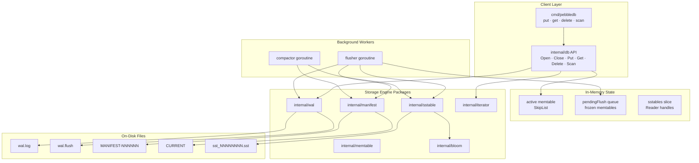

### Data flow summary

| Operation | Path |
|-----------|------|
| Put / Delete | WAL fsync → memtable → maybe flush signal |
| Get | active → pendingFlush (newest first) → SSTables (newest first) + bloom |
| Scan | snapshot memtables + SST iterators → merge iterator |
| Flush | memtable → SST file → manifest → wal.flush → WAL truncate |
| Compaction | merge 2 oldest SSTs → new SST → manifest SetFileSet → delete old |
| Open | manifest → load SSTs → orphan cleanup → WAL replay tail → start workers |

---

## On-Disk Layout

A database directory looks like this after some use:

```
pebbledb-data/
├── CURRENT                 # single line: active manifest filename
├── MANIFEST-000001         # append-only log of live SST set edits
├── wal.log                 # write-ahead log
├── wal.flush               # transient checkpoint during flush (usually absent)
├── sst_00000001.sst
├── sst_00000002.sst
└── ...
```

| File | Purpose |
|------|---------|
| `CURRENT` | Pointer to the active manifest file. Atomically updated via rename. |
| `MANIFEST-NNNNNN` | Append-only log: `NewFile` records on flush, `SetFileSet` on compaction. CRC-protected. |
| `wal.log` | Durability log for all writes. CRC per record. Truncated after successful flush. |
| `wal.flush` | Written between manifest commit and WAL truncate. Enables correct replay offset on crash. Removed after truncate completes. |
| `sst_NNNNNNNN.sst` | Immutable sorted key-value file with blocks, index, bloom, footer. |

---

## Package Structure

```
PebbleDB/
├── cmd/pebbledb/          CLI entry point
├── internal/
│   ├── db/                Orchestration: Open, workers, Get, Scan, recovery
│   ├── wal/               Write-ahead log
│   ├── memtable/          Concurrent skip list + snapshot
│   ├── sstable/           SSTable writer, reader, block, index, iterator
│   ├── manifest/          Live SST set log
│   ├── bloom/             Bloom filter for SSTables
│   └── iterator/          K-way merge iterator for Scan
├── go.mod
└── README.md
```

Dependency direction (no cycles):

```
cmd/pebbledb → db → {wal, memtable, sstable, manifest, iterator}
                              sstable → bloom
```

---

## Feature Catalogue

| Feature | Package(s) | Description |
|---------|--------------|-------------|
| Put / Get / Delete | `db`, `memtable`, `wal` | Basic KV operations with durability |
| Range Scan | `db`, `iterator`, `memtable`, `sstable` | Half-open `[start, end)` scan, merge semantics |
| WAL with CRC | `wal` | Checksum per record, size limits, partial tail salvage |
| Skip list memtable | `memtable` | Concurrent sorted map with tombstones |
| Memtable snapshot | `memtable` | Copy-on-read for non-blocking scan |
| SSTable with blocks | `sstable` | 4 KiB blocks, binary index, footer |
| Per-SST bloom filter | `bloom`, `sstable` | ~1% false positive rate, stored in footer |
| Background flush | `db` | Queue-based, drain-all per wakeup |
| wal.flush checkpoint | `db` | WAL replay offset after flush |
| Background compaction | `db`, `sstable` | Merge oldest 2 SSTs when count >= threshold |
| Manifest live set | `manifest` | NewFile + SetFileSet records |
| Manifest rotation | `manifest` | Compact log when > 64 records or 64 KiB |
| Orphan SST cleanup | `db` | Delete disk files not in manifest on open |
| Crash recovery tests | `db` | Subprocess crash points at flush/compaction stages |
| Background error API | `db` | Writes blocked on flush/compaction failure; reads continue |
| CLI | `cmd/pebbledb` | put, get, delete, scan |
| Reader Ref/Unref | `sstable` | Safe concurrent Get during compaction |
| Close with timeout | `db` | 30s flush drain timeout |

---

## Write Path (Put / Delete)

### Algorithm

```
writeRecord(rec):
  if backgroundErr: return error          // writes only
  lock db.mu
  if closed: return ErrClosed
  wal.Append(rec)
  wal.Sync()                            // durability point
  apply() to memtable
  if active.Size() > threshold:
      append active to pendingFlush queue
      active = new SkipList
      shouldFlush = true
  unlock db.mu
  if shouldFlush: signal flusher
```

### Flow diagram

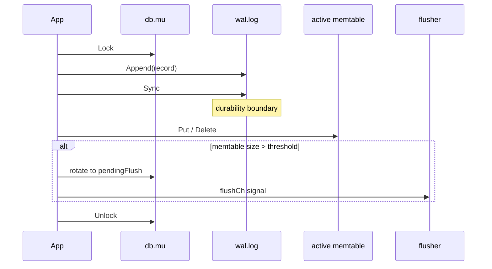

### Design note

I chose **WAL sync before memtable apply**. If the process crashes after WAL sync but before memtable apply, replay restores the record. The opposite order would lose acknowledged writes.

---

## Read Path (Get)

### Lookup order

Newest layer wins. I walk layers from most recent to oldest and stop at the first hit.

```
1. active memtable
2. pendingFlush[latest] .. pendingFlush[oldest]
3. sstables[latest] .. sstables[oldest]  (with bloom skip)
```

### Algorithm

```
Get(key):
  RLock db.mu
  if closed: return ErrClosed
  if active has key: return value or tombstone
  for each pending memtable (newest first):
      if hit: return
  copy sstables slice, Ref each reader
  RUnlock db.mu
  for each SST (newest first):
      if not bloom.MayContain(key): continue
      if SST has key: return value or tombstone
  return ErrNotFound
  defer Unref all readers
```

### Flow diagram

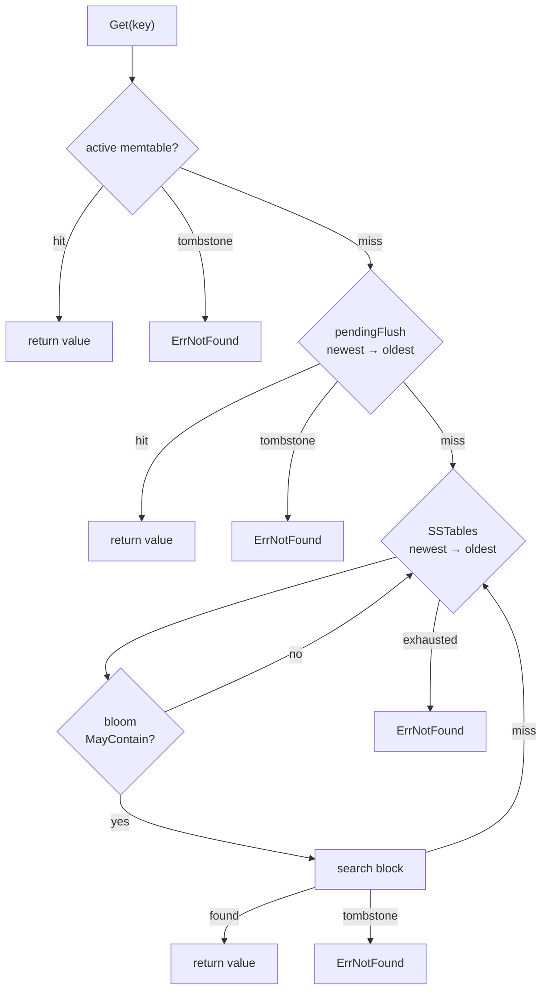

`Get` does not check `backgroundErr`. I decided reads should still work when background flush or compaction is failing, as long as existing data is intact.

---

## Range Scan

### Behaviour

`Scan(start, end)` returns an iterator over the half-open range `[start, end)`. A nil or empty `end` means scan to the last key.

Tombstones are not returned. If the newest version of a key is a tombstone, that key is skipped entirely.

### Snapshot semantics

At `Scan` creation time I snapshot each memtable layer:

```go
activeSnap := db.active.Snapshot()       // brief RLock, copy all entries
pendingSnap := pending[i].mem.Snapshot()
```

Iteration runs over the copy. Writes after `Scan` returns do not appear in the iterator. SST layers are also fixed at creation time (new flushes during scan are not visible).

### Merge iterator algorithm

```
advance():
  loop:
    minKey = minimum key across all valid sources
    if minKey is nil: invalid, return
    among sources at minKey, pick highest priority (newest layer)
    advance all sources at minKey
    if winner is tombstone: continue loop (skip)
    emit winner key/value
```

### Priority assignment

| Layer | Priority |
|-------|----------|
| active snapshot | 1,000,000 |
| pendingFlush[i] | 999,999 - (queue position) |
| sstables[i] | i (higher index = newer file) |

### Flow diagram

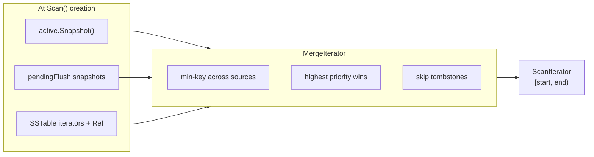

### Scan vs Get concurrency

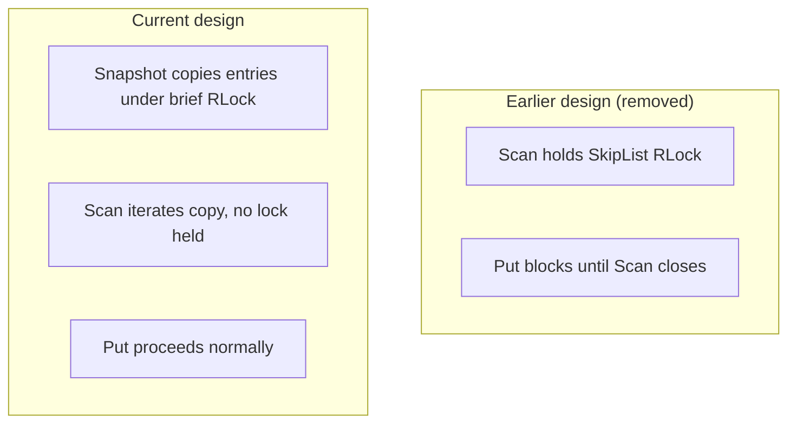

---

## Memtable (Skip List)

I use a skip list instead of a balanced tree because concurrent insertion is simpler: writers take one `Lock`, readers can `RLock` for point lookups, and snapshot copies all level-0 nodes.

### Parameters

| Parameter | Value |
|-----------|-------|
| Max height | 20 |
| Promotion probability | 0.25 |
| Size tracking | Approximate (`key len + 8` per entry) |

### Operations

| Method | Lock | Purpose |
|--------|------|---------|
| `Put` | `Lock` | Insert or update |
| `Delete` | `Lock` | Insert tombstone |
| `Get` | `RLock` | Point lookup |
| `Snapshot` | `RLock` (brief) | Copy all entries for scan |
| `Iterator` | `RLock` (held until Close) | Used only during flush |

### Skip list diagram

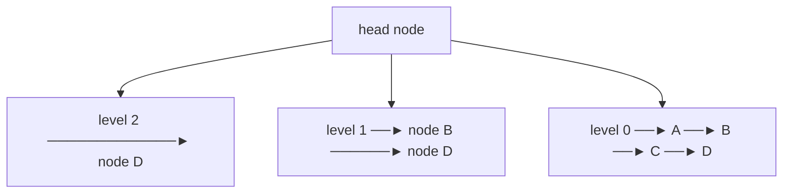

Flush threshold uses `Size()` not `Len()`. Two memtables with the same entry count can differ in bytes. I accept this imprecision for simplicity.

---

## Write-Ahead Log (WAL)

### Record format

```
┌──────────┬─────┬───────────┬───────┬──────────┬───────────┐
│ keyLen   │ key │ valueLen  │ value │ tombstone│ checksum  │
│ 4 bytes  │     │ 4 bytes   │       │ 1 byte   │ 4 bytes   │
└──────────┴─────┴───────────┴───────┴──────────┴───────────┘
```

Checksum is CRC32-IEEE over everything before the checksum field.

### Replay

`ReplayFromWithRecovery` starts at an optional byte offset, verifies each record, and applies a callback. If the file ends with a partial record (crash mid-write), the tail is truncated to the last valid byte.

### Truncate

After flush, `TruncateBefore(offset)` copies bytes `[offset, EOF)` to a new file and atomically replaces `wal.log`. I verify the copy completed fully (`ErrTruncateIncomplete` if not).

### WAL flow

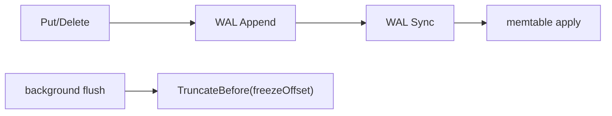

### Size limits (defaults)

| Limit | Value |
|-------|-------|
| Max WAL file size | 64 MiB |
| Max key size | 1 MiB |
| Max value size | 16 MiB |
| Max record size | 17 MiB |

These prevent OOM when replaying a corrupt file.

---

## SSTable Format

Each SSTable is an immutable sorted file.

### File layout

```
┌──────────────────────────────────────┐
│ Block 0 (sorted key-value entries)   │
├──────────────────────────────────────┤
│ Block 1                              │
├──────────────────────────────────────┤
│ ...                                  │
├──────────────────────────────────────┤
│ Index block (last key per block)     │
├──────────────────────────────────────┤
│ Bloom filter blob                    │
├──────────────────────────────────────┤
│ Footer (48 bytes)                    │
└──────────────────────────────────────┘
```

### Footer (version 2)

| Field | Size |
|-------|------|
| Index offset | 8 bytes |
| Index length | 8 bytes |
| Bloom offset | 8 bytes |
| Bloom length | 8 bytes |
| Version | 4 bytes |
| Magic `0x88e241b3` | 4 bytes |
| Reserved | 8 bytes |

### Block entry format

Each entry inside a block:

```
keyLen(4) | key | valueLen(4) | value | tombstone(1)
```

Blocks default to 4096 bytes. When a block is full, it is flushed to disk and a new block starts. Keys must be strictly increasing across the file.

### Write path

SSTables are written to a `.tmp` file first, then renamed to `sst_NNNNNNNN.sst` on close. Readers never see partial files because the manifest only records the SST after the rename succeeds.


---

## Bloom Filter

Each SSTable has a bloom filter built during write. It is stored between the index and the footer.

### Construction

I use standard bloom sizing:

```
m = -n * ln(p) / (ln 2)^2
k = (m / n) * ln 2
```

With `p = 0.01` (1% false positive rate) and `n = expected entry count`.

Hashing uses FNV-1a 64-bit with double hashing (`h1`, `h2`) to derive `k` probe positions.

### Query

```
MayContain(key):
  if m == 0: return true  (safe fallback)
  for i in 0..k-1:
      if bit not set: return false
  return true
```

False negatives never occur. False positives only cause an extra block read.

### Diagram

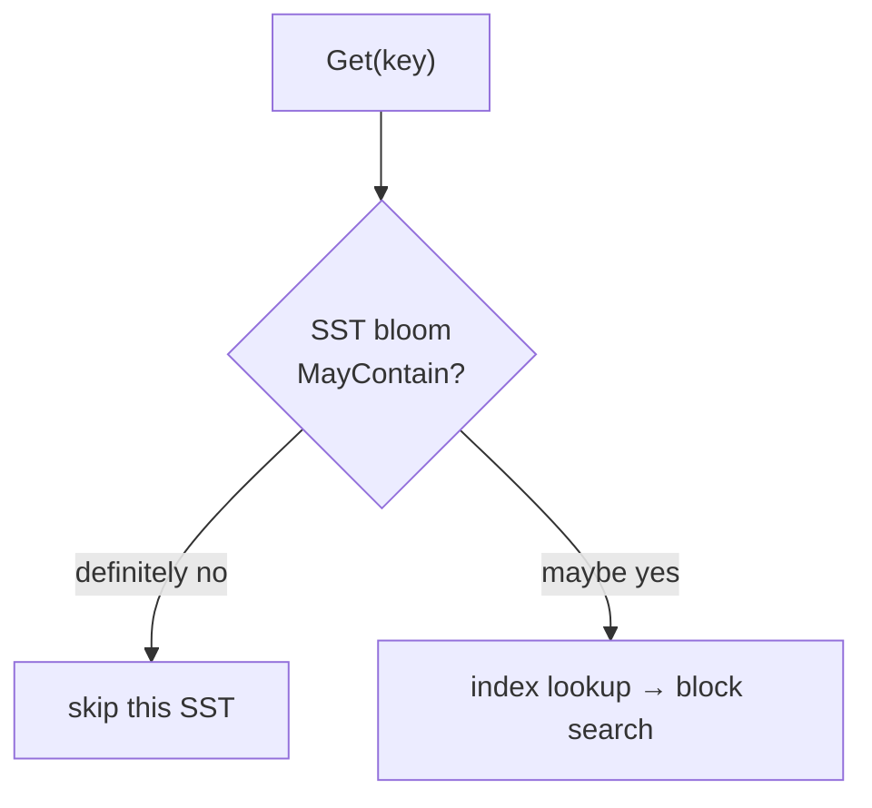

On decode, if `m == 0` or `k == 0` the filter is rejected (`nil` returned) to avoid divide-by-zero panics on corrupt footers.

---

## Background Flush

### Trigger

When `active.Size()` exceeds `MemtableSize` (default 4 MiB), `maybeFlushLocked`:

1. Records `walCutoff = wal.Size()` (byte offset at end of current WAL)
2. Appends the active skip list to `pendingFlush`
3. Replaces `active` with a new empty skip list
4. Signals the flusher goroutine

### Flusher loop

The flusher drains **the entire** `pendingFlush` queue per channel wakeup. I added this after discovering that coalesced channel signals could leave entries stuck forever.

### Flush durability ordering

This ordering is deliberate and was revised after audit:

```
1. Write SSTable to disk (.tmp → rename)
2. manifest.AppendNewFile(id) + fsync     ← durability boundary
3. Append reader to in-memory sstables
4. write wal.flush checkpoint
5. WAL TruncateBefore(walCutoff)
6. remove wal.flush
7. maybeTriggerCompaction
```

If step 4–6 fail, the SST is already durable and visible. WAL cleanup failure is logged but does not fail the flush. On reopen, `wal.flush` guides replay.

### Flush flow

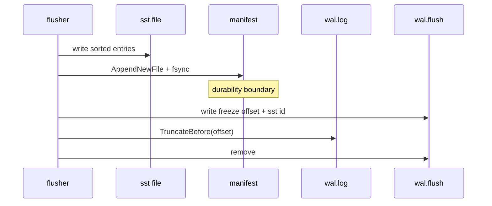

### Queue diagram

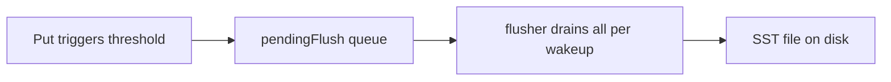

---

## Background Compaction

### Trigger

When `len(sstables) >= CompactionThreshold` (default 4), the compactor merges the **two oldest** SSTables into one new file.

### Algorithm

```
doCompaction():
  pick oldest 2 SST readers
  merge into new SST (MergeReadersKeepTombstones)
  manifest.AppendSetFileSet(new live IDs) + fsync   ← before memory swap
  swap sstables slice (remove 2, add merged)
  Discard old readers, delete old files
  repeat in drain loop while count >= threshold
```

### Merge semantics

For duplicate keys across input SSTs, the **newer** file wins (higher position in `sstables` slice). Tombstones are preserved in the output so deleted keys stay deleted.

### Compaction flow

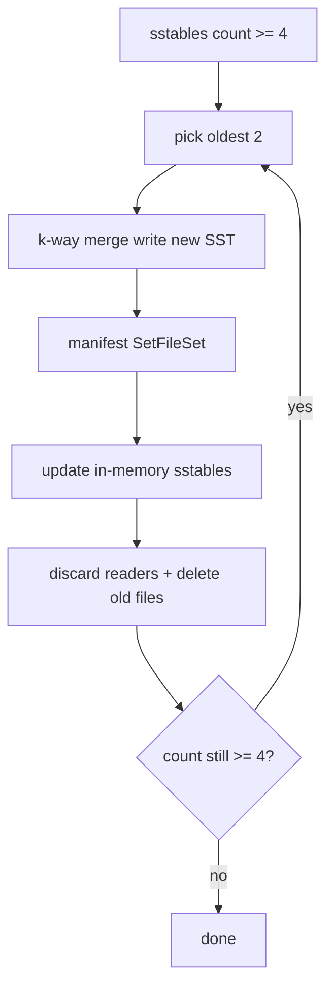

### Manifest-before-memory rule

I learned this the hard way: if you swap `sstables` in memory before the manifest commits and the process crashes, reopen loads the old manifest but memory had already dropped files. Now manifest commit happens first; on failure the merged file is deleted and memory is untouched. If a race invalidates the picked readers after manifest commit, I roll back with `AppendSetFileSet(oldLiveIDs)`.

---

## Manifest

The manifest is an append-only log of edits to the live SST set.

### Record types

| Tag | Name | Payload |
|-----|------|---------|
| `0x01` | NewFile | `sst_id (8 bytes)` |
| `0x02` | DeleteFile | `sst_id` (defined, not used by db yet) |
| `0x03` | SetFileSet | `count + sorted sst_ids` |

Each record: `recordLen(4) | checksum(4) | payload`.

### Replay

On `Open`, the manifest file is replayed from the beginning. CRC failures or partial tail records are salvaged by truncating to the last valid byte (with Windows-safe close-and-truncate).

### Rotation (`MaybeCompact`)

When the log exceeds 64 records or 64 KiB, I rewrite it as a single `SetFileSet` snapshot in a new `MANIFEST-NNNNNN` file and update `CURRENT` atomically. This prevents unbounded manifest growth.

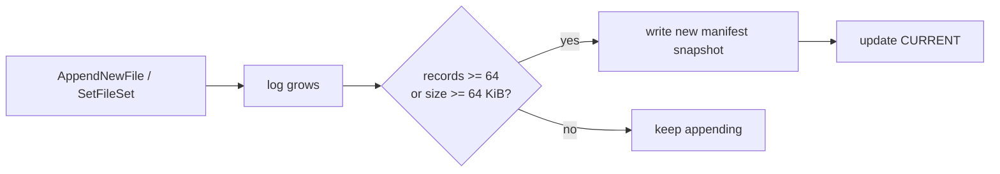

---

## Crash Recovery and wal.flush

### Problem I had to solve

After flush, data exists in both the SST and the WAL. On reopen, I must not replay WAL bytes already captured in the flushed SST, or I get duplicates in memtable that shadow SST data incorrectly.

### Solution

1. Load SSTables from manifest first.
2. Read `wal.flush` if present: `{FreezeOffset, SSTID}`.
3. If `SSTID` is in manifest live set and `wal.size >= FreezeOffset`, replay from `FreezeOffset`.
4. If `wal.size < FreezeOffset` (crash after truncate but before `wal.flush` removal), replay from **0** because offsets refer to the pre-truncate file.

### Recovery flow

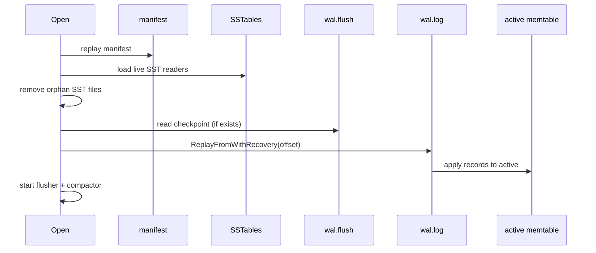

### Crash point testing

I added subprocess integration tests (`crash_recovery_test.go`) that set `PEBBLEDB_CRASH_AT` to exit at specific points:

| Crash point | Stage |
|-------------|-------|
| `flush_after_manifest` | After manifest NewFile |
| `flush_after_wal_state` | After wal.flush written |
| `flush_after_wal_truncate` | After WAL truncate |
| `compact_after_manifest` | After compaction SetFileSet |
| `compact_after_delete_old` | After old SST files deleted |

The parent process reopens the database and verifies data integrity.

---

## Open and Close

### Open sequence

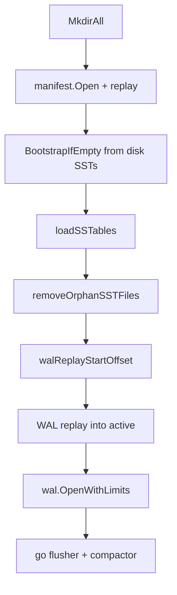

### Close sequence

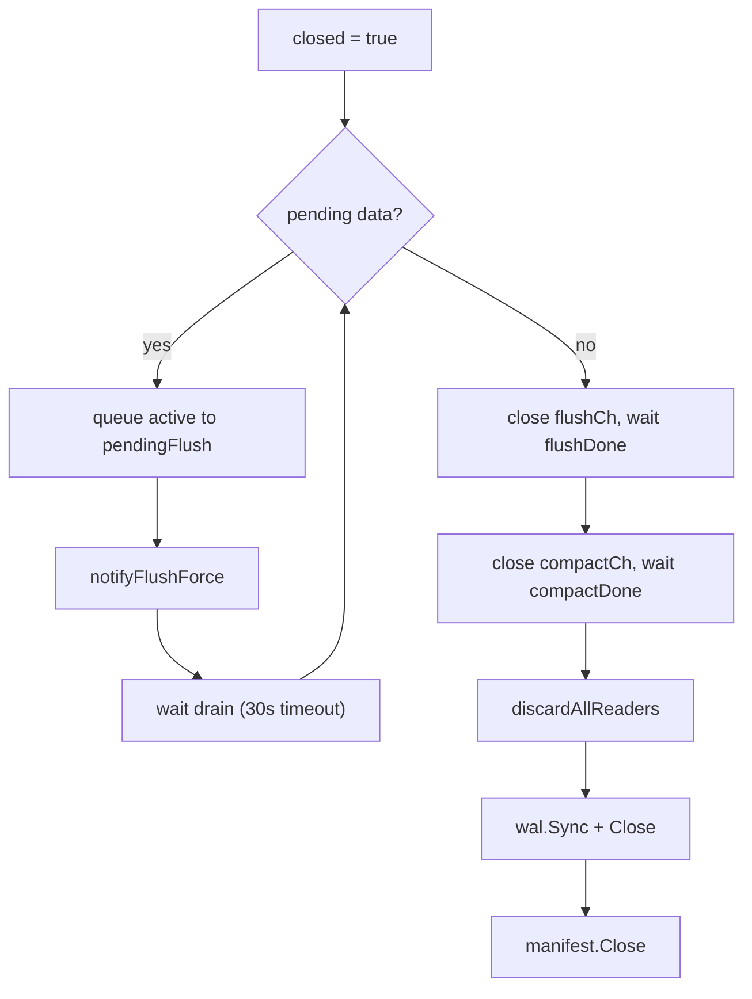

`Close` returns `ErrCloseFlushTimeout` if flush does not drain within 30 seconds. It still tears down resources.

---

## Concurrency Model

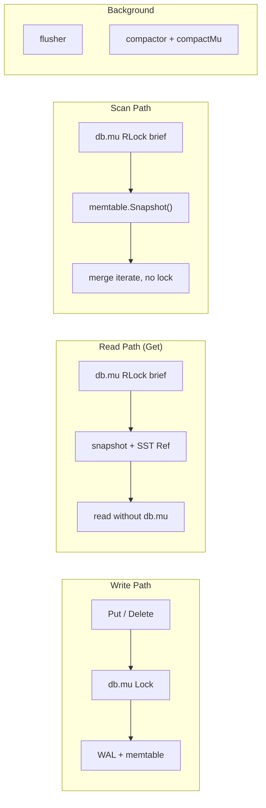

### Lock inventory

| Lock | Protects |
|------|----------|
| `db.mu` | active, pendingFlush, sstables, closed flag |
| `wal.mu` | WAL file writes |
| `manifest.mu` | Manifest file writes |
| `memtable.mu` | Skip list structure |
| `compactMu` | One compaction at a time |
| `readersMu` | allReaders tracking slice |
| `sstable.Reader refs` | File lifetime during concurrent Get |

### SST reader lifetime

Compaction removes old readers from `sstables` but concurrent `Get` may still hold a `Ref`. `Close` marks close-pending; `Discard` force-closes during compaction and shutdown. `trackReader` / `discardAllReaders` ensure no file handle leaks on Windows.

---

## Background Error Policy

| Operation | Blocked on flush/compaction error? |
|-----------|-------------------------------------|
| Put / Delete | Yes |
| Get | No |
| Scan | No |
| BackgroundError() | Returns last error for inspection |

I clear background errors scoped by operation: a successful flush clears only `flush` errors, not `compaction` errors.

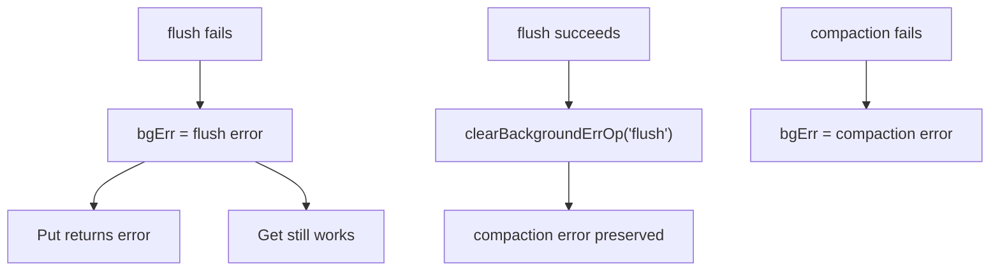

---

## CLI

The `pebbledb` binary wraps the Go API.

```
pebbledb [-dir <path>] put <key> <value>
pebbledb [-dir <path>] get <key>
pebbledb [-dir <path>] delete <key>
pebbledb [-dir <path>] scan [start] [end]
```

Environment variable `PEBBLEDB_DIR` defaults to `./pebbledb-data`.

`get` exits with code 1 when the key is not found.

Each CLI invocation opens the database, runs one command, and closes. There is no long-lived server mode.

---

## Trade-offs

| Decision | Benefit | Cost |
|----------|---------|------|
| LSM over B-tree | Fast sequential writes, immutable files | Compaction needed, read amplification |
| Skip list memtable | Simple concurrent inserts | Approximate size tracking |
| Single writer lock | Easy correctness | No concurrent Put throughput |
| WAL sync before memtable | Durability on crash | Latency per write |
| Manifest before memory on compaction | Crash-consistent live set | Extra fsync per compaction |
| Manifest as durability boundary for flush | SST survives WAL cleanup failure | WAL may grow until cleanup succeeds |
| Oldest-2 compaction | Simple to implement and test | Not optimal write amplification vs leveled |
| Bloom filter per SST | Skips entire files on miss | Extra space, false positives cause extra reads |
| Tombstones in SST | Correct delete semantics | Space not reclaimed until compaction |
| Scan snapshot (copy) | Writes not blocked | Memory spike on large memtable; stale view |
| Background error blocks writes only | Reads work during partial failure | Client must check errors before writing |
| No block cache | Simpler code | Every read hits disk |
| Hardcoded defaults | Less configuration surface | Not tunable without recompile |
| Subprocess crash tests | Real crash boundary coverage | Slower CI, platform-specific |

---

## Configuration Defaults

| Parameter | Default | Location |
|-----------|---------|----------|
| Memtable size | 4 MiB | `db.go` |
| SST block size | 4096 bytes | `db.go` |
| Compaction threshold | 4 SSTables | `compaction.go` |
| Compaction pick count | 2 | `compaction.go` |
| Bloom false positive rate | 1% | `sstable/writer.go` |
| Flush channel buffer | 8 | `db.go` |
| Compaction channel buffer | 8 | `db.go` |
| Flush retry delay | 100 ms | `flush.go` |
| Compaction retry delay | 100 ms | `compactor.go` |
| Close flush timeout | 30 s | `close.go` |
| Manifest compact threshold | 64 records / 64 KiB | `manifest.go` |
| WAL max file size | 64 MiB | `wal/limits.go` |
| Max key size | 1 MiB | `wal/limits.go` |
| Max value size | 16 MiB | `wal/limits.go` |

`Options` struct overrides `MemtableSize`, `CompactionThreshold`, and `WALReplayLimits`.

---

## Building and Running

### Prerequisites

- Go 1.26.1 or compatible (see `go.mod`)

### Build

```bash
cd PebbleDB
go build -o pebbledb ./cmd/pebbledb
```

On Windows:

```powershell
go build -o pebbledb.exe .\cmd\pebbledb
```

### Run the CLI

```bash
# write
./pebbledb put name Alice

# read
./pebbledb get name

# delete
./pebbledb delete name

# scan all keys
./pebbledb scan

# scan a range [start, end)
./pebbledb scan apple banana

# custom data directory
./pebbledb -dir ./my-data put key value
```

Or set the environment variable:

```bash
export PEBBLEDB_DIR=./my-data
./pebbledb put key value
```

### Use as a Go library

```go
package main

import (
    "fmt"
    "github.com/RUDRA-PRATAP-SINGH01/PebbleDB/internal/db"
)

func main() {
    database, err := db.Open(db.Options{Dir: "./pebbledb-data"})
    if err != nil {
        panic(err)
    }
    defer database.Close()

    if err := database.Put([]byte("hello"), []byte("world")); err != nil {
        panic(err)
    }

    val, err := database.Get([]byte("hello"))
    if err != nil {
        panic(err)
    }
    fmt.Println(string(val))
}
```

---

## Running Tests

```bash
# all packages
go test ./...

# with race detector (recommended)
go test ./... -race

# single package
go test ./internal/db -v

# crash recovery tests (subprocess-based)
go test ./internal/db -run Crash -v
```

Tests cover: bloom encode/decode, WAL truncate and partial tail salvage, manifest replay and rotation, skip list and snapshot, SSTable round-trip, merge iterator, flush and compaction integration, scan semantics, background error policy, WAL replay offset edge cases, and subprocess crash recovery.

---

## Project Status and Known Limits

PebbleDB is a complete educational LSM implementation. I trust it for learning, testing, and single-process embedded use. I would not deploy it as a production database without addressing:

- **Scan snapshot staleness**: iterator does not see data flushed after `Scan()` returns
- **Scan memory**: large memtables are fully copied at scan creation
- **Single writer**: all puts serialize on `db.mu`
- **No block cache**: every SST read goes to disk
- **Simple compaction**: oldest-2 merge only, no leveled compaction
- **Single process**: opening the same directory from two processes is unsafe
- **CLI only**: no server, no HTTP, no gRPC

The codebase has no external dependencies beyond the Go standard library. Every package has unit tests, `internal/db` has integration and crash recovery tests, and the race detector passes on my machine.

