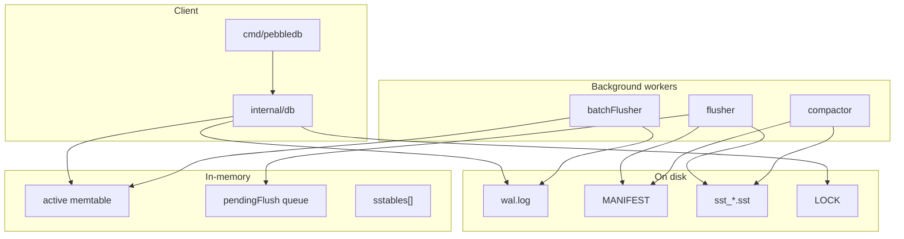
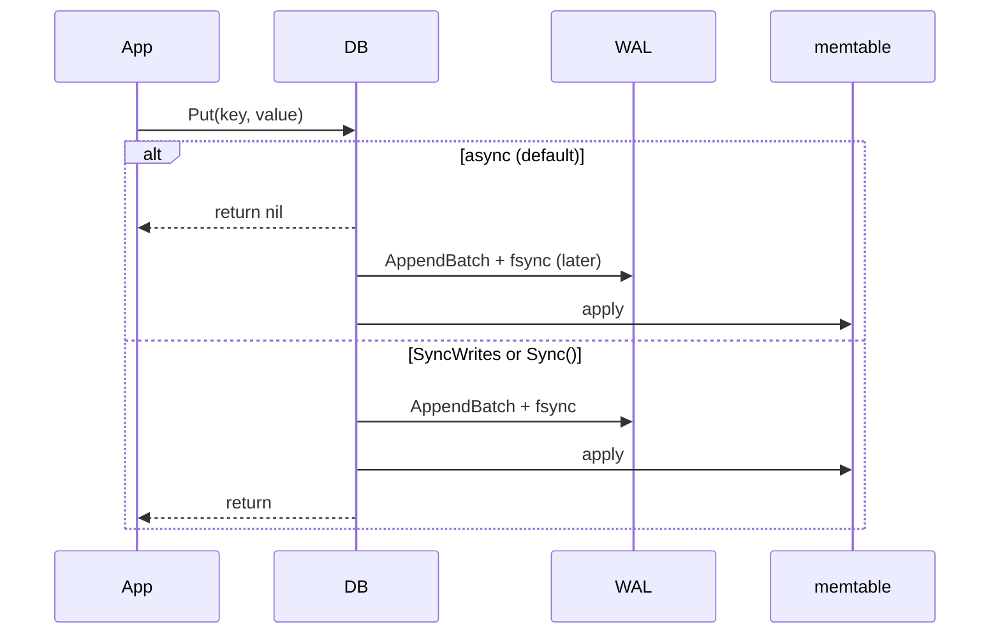
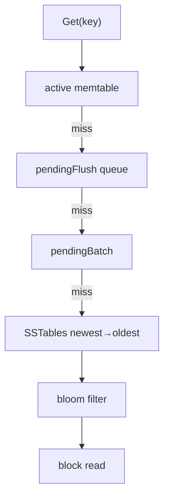

# PebbleDB

I built PebbleDB from scratch in Go — a single-node embedded LSM key-value store. Not a fork of RocksDB or CockroachDB's Pebble. Every layer (WAL, memtable, SSTable, manifest, compaction, recovery) is code I wrote and debugged until crash recovery and concurrent reads behaved correctly.

**Status:** educational embedded engine. Real crash recovery, race-tested compaction. Not production-ready.

Full docs: [docs/](docs/README.md)

---

## Why I built this

I wanted to understand storage engines by building one, not reading about one. I implemented in phases — WAL + memtable first, then SSTables, manifest, compaction, recovery — and fixed real bugs along the way: WAL replay duplicating flushed data, manifest/memory ordering after crashes, compaction racing with in-flight `Get` calls.

---

## Architecture



**Write flow:** `Put` → WAL batch → memtable → background flush → SST + manifest.

**Read flow:** `Get` walks memtable → frozen flush queue → SSTables (newest wins, bloom-filtered).

**Recovery:** load manifest + SSTables first, replay only the WAL tail not yet flushed.

More: [docs/architecture/SYSTEM_OVERVIEW.md](docs/architecture/SYSTEM_OVERVIEW.md)

---

## Core components

| Component | Package | What it does |
|-----------|---------|--------------|
| WAL | `internal/wal` | Append-only log, CRC per record, atomic truncate after flush |
| Memtable | `internal/memtable` | Concurrent skip list; snapshot copy for non-blocking scan |
| SSTable | `internal/sstable` | Immutable sorted files — 4 KiB blocks, index, bloom, footer |
| Manifest | `internal/manifest` | Append-only log of the live SST set; atomic `CURRENT` rotation |
| Iterator | `internal/iterator` | K-way merge for range scan; newest key wins, tombstones hidden |
| Bloom filter | `internal/bloom` | Per-SST negative lookup — skip whole files on miss |
| DB | `internal/db` | Open/Close, workers, recovery, Get/Put/Scan orchestration |
| CLI | `cmd/pebbledb` | `put`, `get`, `delete`, `scan`, `sync` |

---

## Write path

Default mode is **group commit**: `Put` queues records and often returns before WAL fsync. A background flusher batches writes and fsyncs once per ~1 ms or 64 records.



When the memtable exceeds 4 MiB, it freezes into `pendingFlush`, writes an SST, commits to manifest, then truncates the WAL.

Details: [docs/architecture/WRITE_PATH.md](docs/architecture/WRITE_PATH.md)

---

## Read path

`Get` checks layers from newest to oldest and stops at the first hit. SST lookups use a bloom filter to skip files that cannot contain the key.



`Scan` snapshots memtables at creation time and merges with SST iterators. Writes during an open scan do not block.

Details: [docs/architecture/READ_PATH.md](docs/architecture/READ_PATH.md)

---

## Recovery

On `Open`, SSTables load from the manifest — not from directory glob. A `wal.flush` checkpoint records how much of the WAL was already flushed to SST, so replay skips redundant bytes.


Orphan SST files not in the manifest move to `quarantine/`. Crash injection tests exit the process at flush/compaction boundaries and verify data after reopen.

Details: [docs/architecture/RECOVERY.md](docs/architecture/RECOVERY.md) · [docs/postmortems/](docs/postmortems/)

---

## On-disk layout

```
pebbledb-data/
├── LOCK              # single-process lock
├── CURRENT           # points to active manifest
├── MANIFEST-000001   # live SST set edits
├── wal.log           # write-ahead log
├── wal.flush         # flush checkpoint (usually absent)
├── sst_00000001.sst  # immutable sorted runs
└── quarantine/       # orphan SSTs moved on open
```

---

## Capabilities

| Area | Supported |
|------|-----------|
| Writes | Group commit WAL, `Sync()`, `SyncWrites`, memtable flush |
| Reads | Layered `Get`, per-SST bloom, optional block cache |
| Scan | Merge iterator, tombstone filtering, point-in-time snapshot |
| Compaction | Oldest-2 size-tiered merge when SST count ≥ 4 |
| Recovery | Manifest-driven load, `wal.flush` replay offset, orphan quarantine |
| Concurrency | Concurrent `Get`/`Scan`; single writer; `-race` CI on Linux/macOS |
| Crash tests | Subprocess crash at flush/compaction boundaries |
| CLI | `put`, `get`, `delete`, `scan`, `sync` |

**Not included:** replication, transactions, MVCC, SQL, network server.

---

## Quick start

```bash
go build -o pebbledb ./cmd/pebbledb

./pebbledb put hello world
./pebbledb sync              # fsync pending writes (async mode)
./pebbledb get hello

./pebbledb -sync-writes put durable value
./pebbledb scan
./pebbledb scan apple banana   # range [start, end)
```

Library:

```go
database, _ := db.Open(db.Options{Dir: "./data"})
defer database.Close()

database.Put([]byte("k"), []byte("v"))
database.Sync()  // required if not using SyncWrites

val, _ := database.Get([]byte("k"))
```

---

## Testing

```bash
go test ./... -race
go test ./internal/db -run Crash -v
```

CI runs vet, lint, and `go test -race -shuffle=on ./...` on Ubuntu and macOS.

[docs/testing/TESTING_STRATEGY.md](docs/testing/TESTING_STRATEGY.md)

---

## Benchmarks

```powershell
go test ./internal/db -run=NonExistent "-bench=." -benchmem -count=1
```

Async group commit on this machine: ~34k–38k puts/sec (128-byte values). Parallel memtable reads: ~3.1M ops/sec at 4 cores.

[docs/benchmarks/RESULTS.md](docs/benchmarks/RESULTS.md) · [docs/benchmarks/METHODOLOGY.md](docs/benchmarks/METHODOLOGY.md)

---

## Documentation

| Topic | Link |
|-------|------|
| Architecture | [docs/architecture/](docs/architecture/) |
| Design decisions | [docs/design/DECISIONS.md](docs/design/DECISIONS.md) |
| How it evolved | [docs/design/EVOLUTION.md](docs/design/EVOLUTION.md) |
| Bug postmortems | [docs/postmortems/](docs/postmortems/) |
| Diagrams (Mermaid) | [docs/diagrams/](docs/diagrams/) |

---

## Limits

- One process per database directory (`LOCK` file)
- Scan copies the memtable at creation — memory cost on large memtables
- Oldest-2 compaction — read amplification grows with data size
- Iterator does not see data flushed after `Scan()` returns

---

## License

MIT — [LICENSE](LICENSE)
