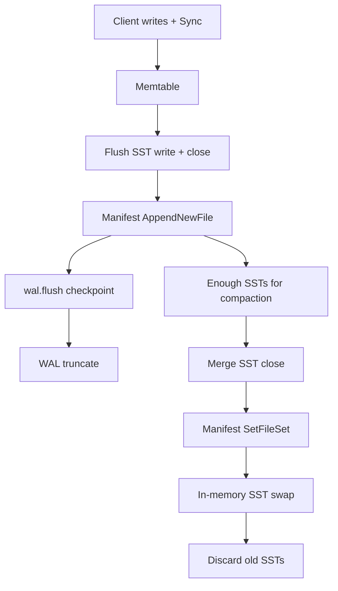

# Flush and compaction crash recovery (ATDD)

This document describes the acceptance tests that certify PebbleDB recovery after a sudden process crash during flush or compaction. The harness is the Acceptance Testing Framework under `internal/db/acceptance/framework/`. How to run it and how the packages fit together are in [testing/ATF.md](testing/ATF.md).

## Goal

A flush moves memtable data into an SSTable, registers it in the manifest, writes a WAL checkpoint, and truncates the WAL. Compaction merges SSTables, rewrites the live file set, and deletes the inputs. If the process dies in the middle of either pipeline, reopen must not lose a write that was already confirmed to the client, must not serve orphan SSTables as live data, and must not duplicate keys already represented on disk.

These are black-box acceptance scenarios: kill the process, reopen the directory, compare against an oracle written before the crash.

## Guarantees under test

| Guarantee | Meaning after recovery |
|-----------|------------------------|
| Confirmed writes survive | Keys written and synced before the crash path are readable via Get and Scan |
| Manifest authority | Only SSTables listed in the live manifest are loaded; orphans are quarantined |
| No stale duplicates | WAL replay must not resurrect values already covered by a flushed SST |
| Tombstones hold | Deleted keys stay absent via Get and never appear in Scan |
| Stable reopen | Close/reopen cycles keep returning the same logical state |

## Crash points that are wired

The engine exposes eight named hooks via `PEBBLEDB_CRASH_AT`. The ATF matrix drives each one end-to-end (write → crash exit 2 → reopen → verify).

| Hook | Pipeline stage |
|------|----------------|
| `flush_after_sst_close` | Flush SST closed, before/around manifest commit |
| `flush_after_manifest` | Manifest NewFile committed |
| `flush_after_wal_state` | wal.flush checkpoint durable |
| `flush_after_wal_truncate` | WAL prefix truncated |
| `compact_after_merge_close` | Compaction output SST closed |
| `compact_after_manifest` | Compaction SetFileSet committed |
| `compact_after_sstables_update` | Memory SST set swapped |
| `compact_after_delete_old` | Old SST files discarded |

Flush scenarios call `ForceMemtableFlush`. Compaction scenarios flush twice (second write pass is an idempotent replay of the oracle so logical state stays the same) then call `ForceCompaction` with threshold 2.

## Verification after each crash

For every hook the parent runs the same verification stack. Logical modules compare the reopened DB to `expected_state.json`. Structural modules inspect the directory without trusting the engine's in-memory view.

| Stage | Module | Checks |
|-------|--------|--------|
| Gate | `metadata_verifier` | Open health, background error, live-count match |
| Point reads | `get_verifier` | Every live/tombstone key |
| Iteration | `iterator_verifier` | Order, uniqueness, Seek |
| Ranges | `range_scan_verifier` | Full / partial / prefix scans |
| Snapshots | `snapshot_verifier` | Concurrent Scan agreement |
| Directory | `directory_audit` | Live set vs on-disk SSTs, no orphans |
| Manifest | `manifest_audit` | CURRENT/MANIFEST replay, non-empty SST files |
| Checkpoint | `checkpoint_audit` | wal.flush shape and SST cross-ref |
| Stability | Idempotent reopen ×3 | Get still matches oracle |

Modules can be ordered by a scenario `verification_dag`. A failed dependency skips dependents; the scenario still fails.

## Pass / fail

PASS means exit code 2 at the requested hook, clean reopen, all modules green, and three idempotent reopens agreeing with the oracle. FAIL keeps the temp directory when retention is enabled and can package it into an evidence zip (`atf_report.json` + directory snapshot).

## Related docs

| Doc | Contents |
|-----|----------|
| [testing/ATF.md](testing/ATF.md) | Framework design, packages, CI job, diagrams |
| [testing/CRASH_TESTING.md](testing/CRASH_TESTING.md) | Low-level `maybeCrash` spawn tests |
| [testing/TESTING_STRATEGY.md](testing/TESTING_STRATEGY.md) | Full test pyramid and CI table |
