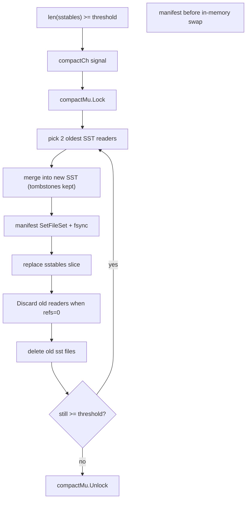
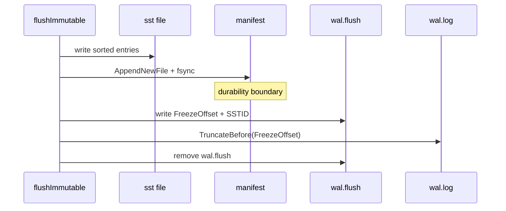

# Compaction

I implemented size-tiered compaction: when live SST count ≥ threshold (default 4), merge the **two oldest** files. I rejected leveled compaction initially because merge correctness and manifest ordering were not stable yet.

## Algorithm

## Merge semantics

`MergeReadersKeepTombstones` walks inputs with a merge iterator. For duplicate keys, **newer file wins** (higher index in `sstables`). Tombstones stay in output so deletes survive compaction.

## Durability ordering

1. Write merged SST to disk.
2. `manifest.AppendSetFileSet` + fsync.
3. Swap `db.sstables`.
4. `Discard` inputs, delete files when refs hit zero.

If step 2 fails: remove merged file, memory unchanged.

If readers invalidated between pick and swap: manifest rollback to `oldLiveIDs`.

## Flush lifecycle (feeds compaction)

## Retry policy

Compaction errors set background `compaction` error, sleep 100ms, retry. Unlike flush, I do not block writes on compaction failure — read amplification grows but ingestion continues.

`CompactionThreshold: -1` disables background compaction (test hook).

## Known weakness

Oldest-2 size-tiering has unbounded read amplification vs leveled compaction. I accept that for project scope.
