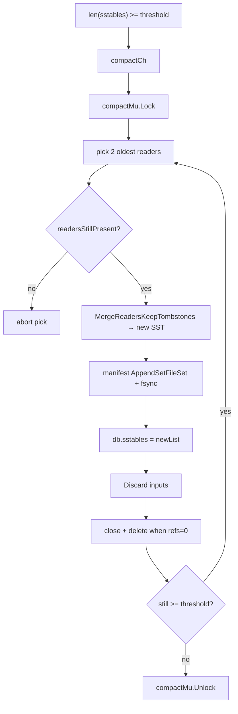
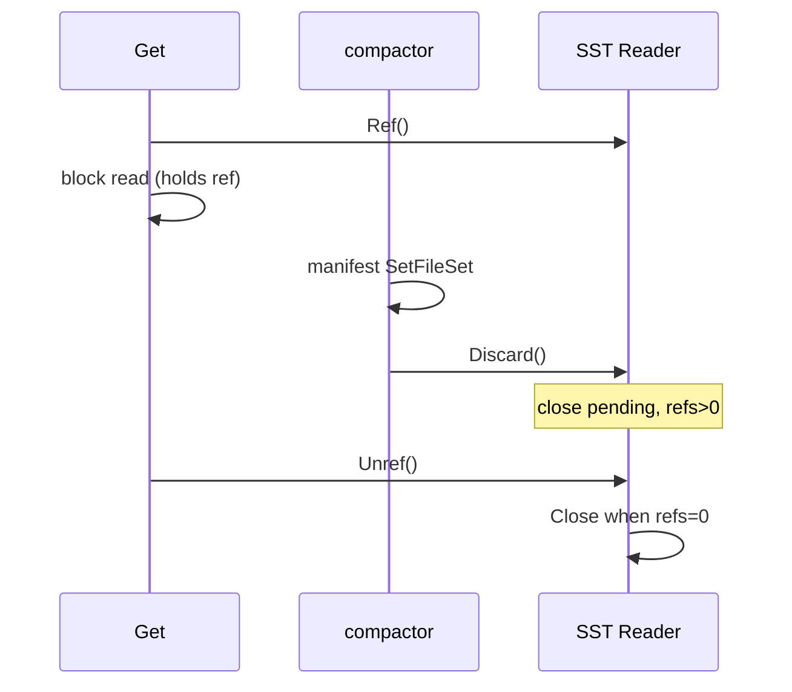
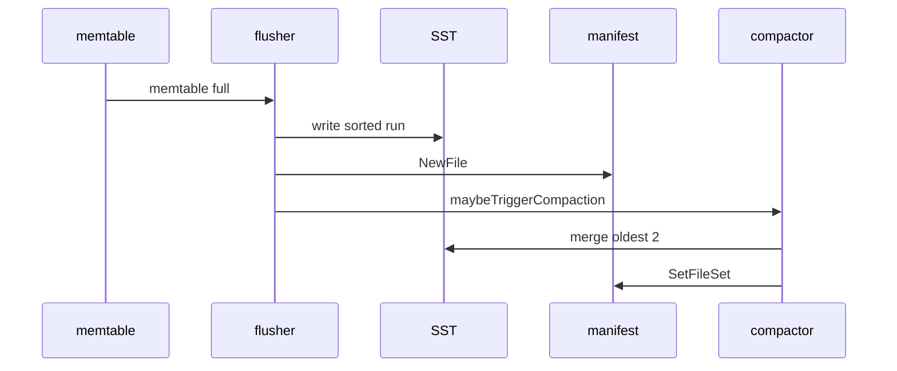

# Compaction

Compaction reclaims disk space and bounds read amplification by merging immutable SSTables into fewer, larger files. PebbleDB uses **size-tiered compaction**: when the live SST count reaches `CompactionThreshold` (default 4), the background compactor merges the **two oldest** files into one output SST. Leveled compaction waits until manifest ordering, reader lifecycle, and crash recovery were stable.

---

## Why compaction exists

Flush turns memtables into SSTs. Without compaction, every flush adds a file; `Get` must consult every file (mitigated by bloom filters, but cost still grows). Deletes leave tombstones in old files until merge removes them.

Compaction goals in PebbleDB:

1. **Reduce file count** — keep `len(sstables)` near threshold.
2. **Merge tombstones** — preserve delete semantics across files.
3. **Preserve durability** — never expose a partial merge; never delete inputs before manifest commit.

Compaction does **not** guarantee optimal read amplification. Oldest-2 size-tiering can leave many files and deep lookup chains — accepted tradeoff ([TRADEOFFS.md](../design/TRADEOFFS.md)).

---

## Trigger and scheduling

`maybeTriggerCompaction()` runs after flush and on `Open` if count ≥ threshold.

Conditions to signal `compactCh`:

- `db.closed` is false
- `compactThreshold > 0` (value `-1` disables compaction — test hook)
- `len(db.sstables) >= compactThreshold`

`compactCh` is buffered (capacity 8); duplicate signals coalesce via `default` case — one compactor wakeup is enough because `doCompaction` loops until count < threshold.

`compactor()` holds `compactMu` for an entire compaction burst so only one compaction sequence mutates pick/manifest at a time.

---

## Pick policy

`pickSSTablesForCompactionLocked` (requires `db.mu`):

- If `len(sstables) < threshold` → pick nothing.
- Else copy **first two** readers from `db.sstables` slice.

The slice order is insertion order: older flushed SSTs sit at lower indices. This is **oldest-2** merge, not size-weighted or overlap-aware.

**Rejected:** leveled compaction (too many moving parts), universal compaction (needs richer metadata), picking by file size (insertion order was sufficient for correctness testing).

---

## Merge algorithm

### Merge semantics

`sstable.MergeReadersKeepTombstones` walks inputs with a merge iterator:

- Keys are emitted in sorted order.
- Duplicate keys: **newer file wins** (higher index in `db.sstables` — inputs are oldest two, so second input wins over first for same key).
- Tombstones are **kept** in output — a delete in an older file survives until a newer put overwrites the key.

**Invariant C1** — deleting then compacting must not resurrect the key unless a put reintroduced it.

Output written to `sst_%08d.sst` via `NewWriter` → `Close` (valid footer + bloom) → `OpenReader`.

Crash point `compact_after_merge_close` fires after merged file is complete on disk but before manifest commit.

---

## Durability ordering

Compaction follows the same **manifest-before-memory** rule as flush ([INVARIANTS.md](../design/INVARIANTS.md) D4):

| Step | Action | On failure |
|------|--------|------------|
| 1 | Merge to new SST on disk | Remove partial file; return error |
| 2 | `manifest.AppendSetFileSet(liveIDs)` + fsync | Remove merged file; memory unchanged |
| 3 | Swap `db.sstables`, `publishSSTables` | — |
| 4 | `trackReader(newReader)` | — |
| 5 | `MaybeCompact()` manifest rotation | Log error; data durable |
| 6 | `Discard()` on each input reader | Log per-reader errors |
| 7 | Physical delete when refs hit 0 | — |

If step 2 succeeds and step 3 crashes: reopen loads merged set from manifest — correct.

If step 2 fails: merged file deleted; inputs still in manifest and memory — correct.

### Reader invalidation rollback

Between pick and manifest commit, another operation might change `db.sstables` (e.g. rare races with structure updates). `readersStillPresent` re-checks before manifest and before memory swap.

If inputs are gone:

- Before manifest: abort, delete merged file.
- After manifest, before swap: `AppendSetFileSet(oldLiveIDs)` rollback, delete merged file.

Rollback failure is logged — disk may need manual repair.

---

## Concurrency with reads

**Invariant V2:** compaction must not close a reader still used by an in-flight `Get` or `Scan`.

`Get` path:

1. `RLock` `db.mu`.
2. Snapshot SST reader pointers; `Ref()` each.
3. `RUnlock`.
4. Search readers; `Unref()` in defer.

Compaction path:

1. Pick reader pointers under `Lock`.
2. After manifest commit, remove from `db.sstables`.
3. `Discard()` sets close-pending; actual `Close` when refs = 0.

On Windows, deleting a file with an open handle fails — refcounting is not optional.

[compaction-race](../postmortems/compaction-race.md).

`lookupSSTReaders` skips readers that return `os.ErrClosed` so a racing close does not panic — falls through to older layers.

---

## Relationship to flush

Flush **creates** SSTs; compaction **merges** them.

WAL truncation happens in flusher after manifest commit — compaction does not truncate WAL directly. Compacted-away keys in old SSTs may still have WAL records until flush+truncate catches up — replay + layer ordering still correct.

---

## Failure modes and retry

| Failure | Behavior |
|---------|----------|
| Merge IO error | Return error; set background `compaction` error; sleep 100ms; retry on next signal |
| Manifest append error | Delete merged file; no memory change |
| `Discard` error | Logged; file may linger until refs drain |
| Compaction disabled (`threshold <= 0`) | SST count grows unbounded; reads slow |

**Invariant C3:** compaction failure does **not** block writes (unlike WAL/flush errors). Read amplification grows; ingestion continues.

---

## Crash boundaries

`PEBBLEDB_CRASH_AT` integration points (`crashpoint.go`):

| Crash point | Expected recovery |
|-------------|---------------------|
| `compact_after_merge_close` | Merged file orphan or quarantined; manifest unchanged; inputs live |
| `compact_after_manifest` | Manifest lists new set; memory may lag until reopen |
| `compact_after_sstables_update` | On disk consistent with manifest |
| `compact_after_delete_old` | Old files gone if refs drained |

`TestCompactionCrashRecovery` subprocess tests verify keys survive each point.

---

## Known weaknesses

1. **Read amplification** — O(number of SSTs) worst case; blooms only help negatives.
2. **Write amplification** — merging same data repeatedly in size-tiering.
3. **No overlap detection** — oldest-2 may merge unrelated key ranges efficiently enough for learning, not for production skew.
4. **Single compactor mutex** — no parallel compactions.
5. **Tombstone retention** — tombstones occupy space until merged past all live versions.

---

## Rejected alternatives

| Alternative | Why rejected |
|-------------|--------------|
| Leveled compaction | Too complex before recovery proven |
| Immediate `Close()` on inputs after swap | Races with in-flight reads |
| Memory swap before manifest | Crash divergence — postmortem |
| Physical delete before manifest | Inputs needed for recovery if manifest fails |
| `DeleteFile` manifest records per input | Non-atomic multi-file update |
| Compaction blocks writes | Chose scoped errors; availability over stall |
| In-memory merge only | No durability until SST on disk |

---

## Configuration

| Option | Default | Effect |
|--------|---------|--------|
| `CompactionThreshold` | 4 | Trigger when `len(sstables) >= n` |
| `CompactionThreshold: -1` | — | Disable background compaction |

---

## Verification

- `compact_test.go` — merge correctness, tombstones, threshold loop
- `TestGetSurvivesCompactionWithHeldRefs` — V2 under refs
- `go test -race` on CI — ubuntu + macos
- Crash subprocess tests per point above
