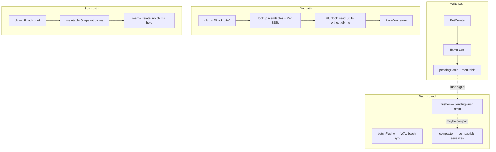

# Concurrency model

PebbleDB uses coarse locking plus immutable SST files. I chose simplicity over multi-writer throughput because correctness bugs in background workers were harder to debug than mutex contention.

## Lock inventory

| Lock | Protects |
|------|----------|
| `db.mu` | `active`, `pendingFlush`, `sstables`, `closed`, batch fields |
| `wal.mu` | WAL file writes |
| `manifest.mu` | manifest appends and rotation |
| `memtable.mu` | skip list structure |
| `compactMu` | one compaction at a time |
| `readersMu` | `allReaders` registry |
| `Reader.refs` | SST file lifetime |

## Worker diagram

Source: [../diagrams/concurrency.mmd](../diagrams/concurrency.mmd)

## Scan isolation

`Scan` uses `memtable.Snapshot()` — copy under brief `RLock`, iterate without lock. See [../postmortems/scan-lock-contention.md](../postmortems/scan-lock-contention.md).

Point-in-time semantics:

- Memtable state frozen at `Scan()` call.
- SST set frozen at `Scan()` call (new flushes not visible).
- Writes after `Scan()` returns are invisible to that iterator.

## Flusher coalescing

`flushCh` has buffer size 8. Signals coalesce. I drain **entire** `pendingFlush` per wakeup because a single signal used to leave entries stuck forever.

## Compaction serialization

`compactMu` ensures one compaction loop at a time. `doCompaction` re-checks `readersStillPresent` after merge because `Get` may have invalidated picks.

## Directory lock

`LOCK` file with non-blocking flock (Unix) or `LockFileEx` (Windows). Second `Open` → `ErrDatabaseLocked`. I fixed Unix errno mapping in commit `95541a8` — `EWOULDBLOCK` was not translated to `ErrDatabaseLocked`, breaking CI tests on Linux.

## What I did not implement

- Lock-free memtable (skip list already has `RWMutex`)
- Single-writer WAL with multiple readers without `db.mu`
- RCU for `sstables` slice — I use copy + atomic pointer instead

## Related

- [../postmortems/compaction-race.md](../postmortems/compaction-race.md)
- [../postmortems/shutdown-ordering.md](../postmortems/shutdown-ordering.md)
