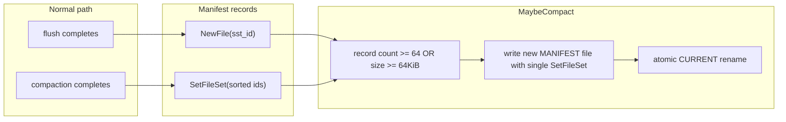

# Manifest design

The manifest is the authoritative list of live SSTables. I learned not to infer live files from directory glob alone.

## Record types

| Tag | Name | Payload |
|-----|------|---------|
| `0x01` | NewFile | `sst_id` u64 BE |
| `0x02` | DeleteFile | `sst_id` (defined, unused by db) |
| `0x03` | SetFileSet | `count` + sorted `sst_id` list |

Wire format per record: `recordLen(4) | crc32(4) | payload`.

## Live set operations

| Event | Manifest action |
|-------|-----------------|
| Flush completes | `AppendNewFile(id)` |
| Compaction completes | `AppendSetFileSet(newIDs)` |
| Rotation | single `SetFileSet` snapshot in new file |

## CURRENT pointer

`CURRENT` holds one line: active manifest filename. Update protocol:

1. Write `CURRENT.tmp` with new name.
2. Fsync.
3. Atomic rename to `CURRENT`.

I fixed rotation crashes in commit `fd701a3` — partial manifest files must never become current.

## Replay salvage

On open, CRC failure or partial tail → truncate manifest to last valid record. On Windows I close the file handle before truncate (rename/delete races).

## Bootstrap

Empty manifest + SST files on disk from crash → `BootstrapIfEmpty` seeds live set from discovered ids. I only trust discovered ids after validating filename pattern `^sst_\d{8}\.sst$`.

## Why append-only

I rejected in-place live set files:

- Crash mid-write corrupts entire set
- Append + occasional snapshot compaction is simpler to reason about
- Matches LevelDB manifest style I studied
