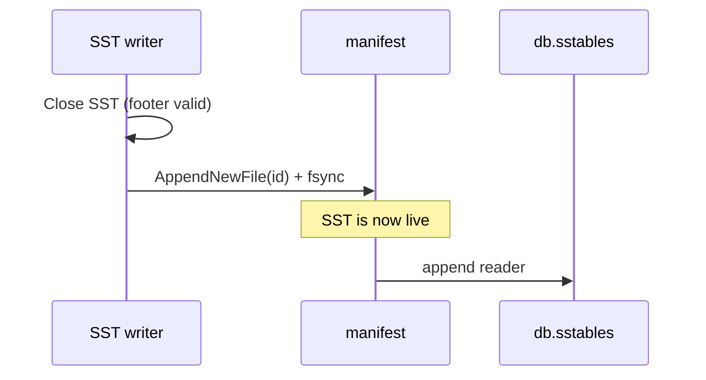
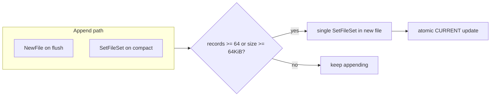

# Manifest design

The manifest is the **authoritative list of live SSTables**. PebbleDB does not treat directory listing as truth: an `sst_00000042.sst` file on disk is garbage until the manifest says otherwise, and a manifest entry without a matching file is an open error. Glob-based discovery broke after compaction crashes — [manifest-consistency](../postmortems/manifest-consistency.md).

---

## Why a manifest exists

Early PebbleDB discovered SSTs by globbing `sst_*.sst`. Problems:

- Compaction crash: merged file on disk, manifest never updated → duplicate or orphan files.
- Compaction crash: manifest updated in memory, not fsynced → wrong live set on reopen.
- Flush crash: SST complete, not in any index → data exists but `Get` cannot find it.

The manifest is an append-only log of **edits** to the live set, similar in spirit to LevelDB's `MANIFEST`. `CURRENT` points at the active manifest file.

**Invariant D3** (see [INVARIANTS.md](../design/INVARIANTS.md)): manifest defines liveness.

---

## On-disk layout

```
data_dir/
  CURRENT                 # single line: e.g. MANIFEST-000003
  MANIFEST-000001         # append-only edit log (historical)
  MANIFEST-000003         # current active manifest
  sst_00000001.sst
  ...
```

`CURRENT` update protocol (`internal/manifest/manifest.go`):

1. Write `CURRENT.tmp` with manifest filename + newline.
2. Fsync.
3. Atomic rename to `CURRENT`.

`CURRENT` is not updated to point at a partial manifest file. Rotation fix: `fd701a3` (C1/C2/C3 data loss windows).

---

## Record wire format

Each manifest record:

```
recordLen (4 bytes BE, includes crc + payload)
crc32     (4 bytes, IEEE over payload)
payload   (recordLen - 4 bytes)
```

Payload types:

| Tag | Name | Body |
|-----|------|------|
| `0x01` | NewFile | `sst_id` uint64 BE |
| `0x02` | DeleteFile | `sst_id` uint64 BE (defined; **unused** by db package) |
| `0x03` | SetFileSet | `count` uint32 BE + `count` × `sst_id` uint64 BE (sorted on encode) |

`SetFileSet` **replaces** the entire live set in one edit. `NewFile` adds one id to the current set. I use `NewFile` on flush and `SetFileSet` on compaction because compaction atomically swaps multiple files.

Every append:

1. Write record bytes.
2. `fsync` manifest file.
3. Apply edit to in-memory `liveSet` map.

If fsync fails, in-memory state is not advanced (`append` in `manifest.go`).

---

## Live set operations

| Event | Manifest action | Memory update timing |
|-------|-----------------|----------------------|
| Flush completes SST | `AppendNewFile(id)` | After manifest fsync, `db.sstables` append |
| Compaction completes | `AppendSetFileSet(newIDs)` | After manifest fsync, replace `db.sstables` |
| Rotation threshold hit | New file, single `SetFileSet` snapshot, `CURRENT` swap | Under `l.mu` throughout |

**Invariant D4**: manifest fsync **before** in-memory SST slice update.

### Flush path



If `AppendNewFile` fails, SST file is removed and never exposed to reads.

### Compaction path

Compaction builds `liveIDs` from the post-merge reader list, then `AppendSetFileSet(liveIDs)`. If readers picked for compaction are no longer in `db.sstables` (concurrent structure change), manifest rolls back to `oldLiveIDs` and merged file is deleted — see `doCompaction` in `compactor.go`.

---

## Replay and salvage

On `manifest.Open`:

1. Read `CURRENT` → open manifest file.
2. Scan records from offset 0.
3. Verify CRC; apply each edit to `liveSet`.
4. On partial tail (crash mid-record): truncate file to `validEnd` and continue.

Windows note: `truncateTo` **closes** the file handle before `os.Truncate`, then reopens for append. Open handle + truncate caused replay failures on Windows during development.

Salvage is **last valid prefix wins** — same philosophy as WAL tail salvage.

---

## Rotation (`MaybeCompact`)

Append-only logs grow forever without compaction. When `recordCount >= 64` **or** file size `>= 64 KiB`, `MaybeCompact`:

1. Takes `l.mu` for the entire operation (no concurrent append to a file about to be deleted).
2. Writes new `MANIFEST-NNNNNN` containing a **single** `SetFileSet` snapshot of current `liveSet`.
3. Fsync new file; close.
4. Atomic `CURRENT` rename to new file.
5. Deletes old manifest file.



**Crash during rotation** was a major bug class: `CURRENT` updated before new manifest fsync'd → open reads truncated manifest. Fix: temp file + fsync + rename for both `CURRENT` and manifest snapshots.

---

## Bootstrap

`BootstrapIfEmpty(existingIDs)` runs when manifest `liveSet` is empty but `discoverSSTIDs` found SST files on disk — upgrade path for directories created before manifest existed.

Writes one `SetFileSet` with discovered ids. Discovery accepts only `^sst_\d{8}\.sst$` (commit `0a7a5fa` rejects malformed names).

Bootstrap is **not** used when manifest already has records — orphans stay orphans and go to quarantine on `Open`.

---

## Orphans and quarantine

`loadSSTables` opens readers only for manifest ids. `removeOrphanSSTFiles` moves other valid-pattern SSTs to `quarantine/`.

| File state | Manifest | Behavior |
|------------|----------|----------|
| On disk, in manifest | — | Loaded |
| On disk, not in manifest | — | Quarantined |
| In manifest, missing on disk | — | `Open` error |
| Malformed filename | — | Ignored |

Orphan SSTs move to `quarantine/` instead of deletion.

---

## Interaction with `wal.flush`

`wal.flush` stores `SSTID` of the SST that absorbed WAL prefix `[0, FreezeOffset)`. On open, if that `SSTID` is **not** in manifest live set, checkpoint is ignored and WAL replays from 0 — prevents trusting a checkpoint for a flush that never committed to manifest.

---

## Failure modes

| Failure | Outcome |
|---------|---------|
| Manifest append IO error | Flush/compaction fails; SST not swapped into memory (if before apply) |
| CRC error on open | Salvage to last good record or fail |
| `CURRENT` points to missing file | Open fails |
| Rotation crash | Previous manifest may still be referenced by `CURRENT` if rename not done; partial new file ignored |
| Concurrent append during rotation | Prevented by holding `l.mu` across rotate |

Compaction manifest rollback failure is logged (`compaction manifest rollback failed`) — rare path if disk fails during rollback.

---

## Durability ordering summary

| Operation | Durable boundary | What becomes live |
|-----------|------------------|-------------------|
| Flush | `AppendNewFile` fsync | New SST id |
| Compaction | `AppendSetFileSet` fsync | New merged set |
| Rotation | New manifest fsync + `CURRENT` rename | Same logical set, new file |

WAL truncate and `wal.flush` removal happen **after** manifest commit on flush — SST must be findable via manifest before WAL prefix is discarded.

---

## Rejected alternatives

| Alternative | Why rejected |
|-------------|--------------|
| Directory glob as live set | Orphans and missing files after crash |
| In-place rewrite of live set file | Crash mid-write corrupts entire set |
| Memory-first, manifest later | Post-crash divergence — see postmortem |
| `DeleteFile` per compaction input | `SetFileSet` gives atomic multi-file swap in one record |
| Immediate `os.Remove` on orphan SST | Destroys evidence; quarantine is safer |
| Manifest without fsync per record | Crash could lose last flush/compaction commit |
| Single unbounded MANIFEST file | Rotation contains growth; 64 KiB threshold is cheap |

---

## Testing

- `manifest_test.go` — append, replay, rotation, concurrent append
- `crash_recovery_test.go` — `flush_after_manifest`, `compact_after_manifest`
- `TestManifestIgnoresOrphanSSTAfterCompactionCrash` — orphans do not affect reads
