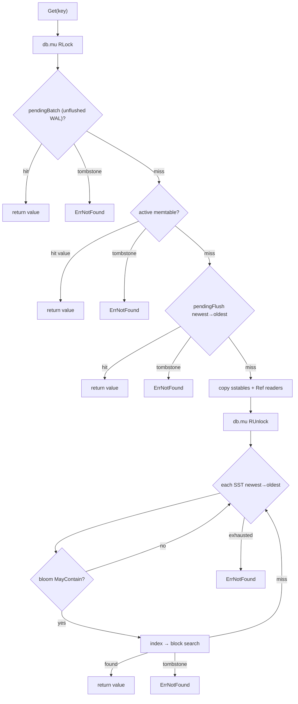

# Read path

`Get` is a layered lookup: newest wins. Tombstones, pending batch, and compaction races come before bloom filters for skipping cold SST files.

## Lookup order

```
1. pendingBatch (records accepted by Put but not yet applied to memtable)
2. active memtable
3. pendingFlush (newest → oldest)
4. sstables (newest → oldest), bloom-filtered
```




## Why I check pendingBatch first

With group commit, a record can be in `pendingBatch` after `Put` returns but before memtable apply. `Get` must see it or I would violate read-your-writes within a process. `pendingBatch` is newer than the active memtable for keys written in the current group-commit window.

## SST search

Under brief `RLock`:

1. Copy `sstables` slice pointer (also published via `atomic.Pointer` for some paths).
2. `Ref()` each reader I will consult.

After `RUnlock`:

1. Walk newest → oldest.
2. `bloom.MayContain(key)` — skip file on definite miss.
3. Binary search index block → load data block → scan entries.

`Unref()` in defer when `Get` returns.

Closed SST readers during compaction are skipped (`errors.Is(err, os.ErrClosed)`) so in-flight lookups fall through to older layers.

## Tombstones

Newest tombstone → `ErrNotFound`. Older values hidden by tombstone in a newer layer are never visible. Compaction keeps tombstones until keys are dropped from output by merge semantics.

## Bloom filter role

I added blooms in commit `ec4cee5` when linear SST scans became measurable. False positives cost one extra block read; false negatives never occur by construction.

## Performance work

Commit `052812d` overhauled the read path:

- LRU block cache (`hashicorp/golang-lru/v2`) — optional via `BlockCacheSize`
- `sstablesSnap` atomic snapshot to shorten lock hold
- Bloom before index probe

I still accept higher read amplification than leveled compaction engines — my compaction policy is naive.

## Background errors

`Get` ignores background errors. A stuck flush does not block reads of durable data.
