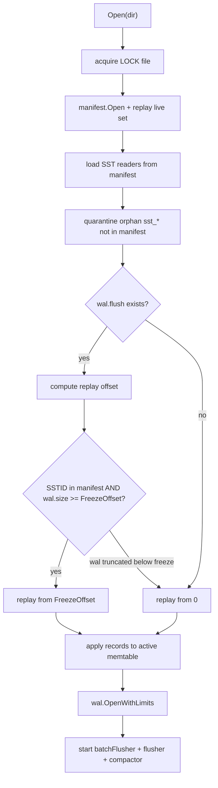

# Recovery

Recovery is the part I trust least in any storage engine until tests prove otherwise. PebbleDB recovery is manifest-driven SST loading plus **bounded** WAL replay.

## Open sequence

## wal.flush checkpoint

I introduced `wal.flush` after discovering full WAL replay duplicated flushed state. File format (16 bytes):

| Field | Size |
|-------|------|
| `FreezeOffset` | 8 bytes BE |
| `SSTID` | 8 bytes BE |

Written after manifest records new SST, before WAL truncate. Removed after successful truncate.

### Offset selection logic

`walReplayStartOffset()` (`internal/db/wal_state.go`):

- No file → replay from 0.
- SST id not in manifest → replay from 0 (orphan checkpoint).
- `wal.size < FreezeOffset` → replay from 0 (truncated file; old offsets invalid).
- Else → replay from `FreezeOffset`.

I learned the third case from `TestWalReplayStartOffsetWhenWalTruncatedBelowFreeze`.

## Orphan SST handling

Files matching `sst_*.sst` on disk but not in manifest live set move to `quarantine/` on open. I quarantine instead of delete so I can inspect compaction crashes.

Malformed filenames (`sst_badname.sst`) are skipped — commit `0a7a5fa`.

## WAL replay limits

`wal.ReplayLimits` caps key/value sizes during replay to prevent OOM on corrupt files (default max value 16 MiB, max WAL 64 MiB). Partial tail records truncate to last valid checksum.

## Crash injection coverage

| Crash point | Validates |
|-------------|-----------|
| `flush_after_manifest` | SST durable before WAL cleanup |
| `flush_after_wal_state` | checkpoint written |
| `flush_after_wal_truncate` | truncate completed |
| `compact_after_manifest` | merged set committed |
| `compact_after_delete_old` | old files removed |
