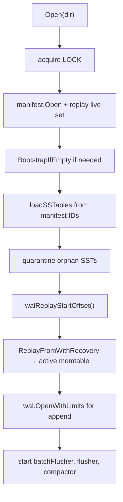

# Recovery

Recovery is what `Open(dir)` does after clean shutdown, `kill -9`, or power loss. PebbleDB loads SSTables from the manifest, then replays a **bounded** WAL tail into the active memtable.

---

## SST-first, WAL-tail

1. **Manifest** defines which SST files are live.
2. Load those SSTs — they hold data flushed before crash.
3. **WAL** holds records not yet in a flushed SST prefix (or the full file if no checkpoint applies).
4. Replay WAL into `active` memtable (SST layers already loaded).

Early versions replayed the **entire** WAL after SST load. Flushed keys existed in both SST and memtable — duplicate state, wrong shadows, resurrected deletes. Fix: `wal.flush` + `walReplayStartOffset()` ([wal-replay-bug](../postmortems/wal-replay-bug.md)). Invariant R4 in [INVARIANTS.md](../design/INVARIANTS.md).

---

## Open sequence

Code: `internal/db/db.go` `Open`.

### Step-by-step

**1. Directory lock** (`LOCK` file)

Second process gets `ErrDatabaseLocked` (Unix `flock` maps `EWOULDBLOCK`/`EAGAIN` — commit `95541a8`). Two writers corrupt WAL.

**2. Manifest open**

Read `CURRENT`, open manifest file, replay records into `liveSet`, salvage partial tail if needed.

**3. Bootstrap**

If manifest empty but SST files exist (pre-manifest era), `BootstrapIfEmpty` writes initial `SetFileSet` from discovered ids.

**4. Load SSTables**

For each id in manifest (sorted), open `sst_%08d.sst` reader. Missing file → open fails. Malformed paths rejected.

**5. Quarantine orphans**

`discoverSSTIDs` glob vs manifest: extras matching `^sst_\d{8}\.sst$` move to `quarantine/`. Not loaded; not deleted.

**6. WAL replay offset**

`walReplayStartOffset()` reads optional `wal.flush` — see next section.

**7. WAL replay**

`wal.ReplayFromWithRecovery(wal.log, limits, offset, applyFn)` applies puts/deletes to `active` memtable. Partial tail truncated.

**8. WAL open for write**

New append handle with same limits.

**9. Background workers**

`batchFlusher`, `flusher`, `compactor`; maybe trigger compaction if SST count high.

---

## wal.flush checkpoint

File: `wal.flush` (16 bytes), written during flush **after** manifest `NewFile` fsync, **before** WAL truncate.

| Field | Size | Meaning |
|-------|------|---------|
| `FreezeOffset` | 8 BE | WAL byte offset; bytes before this are in SST `SSTID` |
| `SSTID` | 8 BE | Flushed SST id |

Written via temp + fsync + rename (`wal_state.go`). Removed after successful `TruncateBefore`.

### Offset selection (`walReplayStartOffset`)

| Condition | Replay start |
|-----------|--------------|
| No `wal.flush` | 0 |
| Read error (non-notexist) | Propagate |
| `SSTID` ∉ manifest | 0 — ignore stale/orphan checkpoint |
| `FreezeOffset < 0` | 0 |
| `wal.log` size < `FreezeOffset` | 0 — WAL truncated below freeze; entire file is tail |
| Else | `FreezeOffset` |

#### Why `wal.size < FreezeOffset` replays from 0

Crash sequence:

1. `wal.flush` written (points at offset 1MB).
2. Truncate succeeds → WAL is 200KB.
3. Crash before `removeWalFlushState`.

On open: checkpoint exists but file is shorter than freeze. Bytes `[0, FreezeOffset)` no longer exist — they were truncated. The SST holds that data. Replaying from 0 on the **200KB** file applies only the tail — correct.

`TestWalReplayStartOffsetWhenWalTruncatedBelowFreeze` locks this behavior.

#### Why unknown `SSTID` replays from 0

Manifest never committed the flush for that SST id (or compaction removed it). Trusting the checkpoint would skip WAL bytes not in any live SST — data loss.

---

## Layered state after recovery

After `Open` completes, a key may exist in:

| Layer | Source |
|-------|--------|
| SST readers | Flushed before crash |
| `active` memtable | WAL replay + any post-open writes |
| `pendingFlush` | Empty on fresh open (queue is memory-only) |
| `pendingBatch` | Empty on fresh open |

`Get` searches pending batch → active → pending flush → SSTs (newest first). See [READ_PATH.md](READ_PATH.md).

---

## WAL replay salvage

`ReplayFromWithRecovery`:

- Rejects files larger than `MaxFileSize`.
- On incomplete last record: truncate WAL to `validEnd`, stop cleanly.
- CRC failure in middle of file: open fails (no silent skip).

This matches manifest tail salvage philosophy: **last valid prefix**.

---

## Flush recovery crash matrix

| Crash after | On-disk artifacts | Reopen behavior |
|-------------|-------------------|-----------------|
| SST written, before manifest | SST orphan → quarantine | WAL full replay; data in WAL |
| Manifest `NewFile` fsync | SST live in manifest | WAL replay; may duplicate in memtable until read ordering — data not lost |
| `wal.flush` written | Checkpoint + full WAL | Replay from `FreezeOffset` |
| WAL truncate done | Short WAL + maybe `wal.flush` | Replay from 0 on short WAL |
| `wal.flush` removed | Short WAL, no checkpoint | Replay from 0 |

Subprocess tests: `flush_after_manifest`, `flush_after_wal_state`, `flush_after_wal_truncate`.

---

## Compaction recovery crash matrix

| Crash after | On-disk artifacts | Reopen behavior |
|-------------|-------------------|-----------------|
| Merge file closed | Orphan merged SST | Quarantine; manifest unchanged |
| Manifest `SetFileSet` fsync | New live set durable | Load merged SST; inputs may still exist on disk until delete completed |
| Memory swap | Same as manifest | Consistent |
| Old SSTs deleted | Manifest + merged only | Normal |

Subprocess tests: `compact_after_manifest`, `compact_after_delete_old`.

If manifest lists a file that was deleted prematurely → open fails (file missing). This is preferable to silent loss.

---

## Orphan and quarantine policy

**Invariant R2** — orphans never auto-join live set.

Quarantine preserves files for debugging compaction crashes. Manual recovery: inspect file, optionally restore with tooling (not shipped).

Malformed names (`sst_bad.sst`) are not discovered and not quarantined — ignored to avoid path tricks.

---

## Clean shutdown vs crash

`Close()` path (success):

1. Stop accepting writes; drain `pendingBatch`.
2. Queue active memtable to `pendingFlush`; drain flusher (bounded 30s).
3. Stop workers; sync WAL; close manifest; release LOCK.

`Close()` may return `ErrCloseIncomplete` if drain times out — WAL/manifest left open intentionally ([shutdown-ordering postmortem](../postmortems/shutdown-ordering.md)).

Crash mid-write:

- Rely on WAL + manifest invariants.
- Never assume `Close` ran.

---

## Failure modes on open

| Error | Typical cause |
|-------|---------------|
| `ErrDatabaseLocked` | Second process |
| `ErrCorruptWalFlushState` | Truncated `wal.flush` (< 16 bytes) — file removed, replay from 0 |
| WAL CRC error | Media corruption or torn write |
| `ErrWALTooLarge` | WAL exceeds replay cap |
| Missing SST for manifest id | Manual delete or severe bug |
| Manifest CRC / salvage failure | Truncated manifest |

Background errors from previous run are not persisted — fresh open clears runtime error state.

---

## Recovery and concurrency

Recovery is single-threaded during `Open`. Workers start only after replay completes. No concurrent `Get` during replay.

After open, normal concurrency rules apply ([CONCURRENCY_MODEL.md](CONCURRENCY_MODEL.md)).

---

## Testing strategy

| Test | What it proves |
|------|----------------|
| `wal_state_test.go` | Offset logic edge cases |
| `crash_recovery_test.go` | Subprocess crash at each `PEBBLEDB_CRASH_AT` point |
| `manifest_test.go` | Manifest replay + rotation |
| `TestManifestIgnoresOrphanSSTAfterCompactionCrash` | Orphans invisible to reads |
| `TestRapidPutNoLossDuringAsyncFlush` | Write path not losing batched records |

`PEBBLEDB_CRASH_TEST=1` child runs with `PEBBLEDB_CRASH_AT` set; parent reopens and asserts keys.

CI: `go test -race -shuffle=on ./...` on Linux and macOS.

---

## Rejected recovery designs

| Alternative | Why rejected |
|-------------|--------------|
| Full WAL replay always | Duplicates flushed data — root wal-replay bug |
| WAL as sole source of truth (no manifest) | Cannot define live SST set after compaction crash |
| Glob SST + full WAL | Loads orphan/compaction garbage |
| Delete orphan SST on open | Destroys forensic state |
| In-place WAL truncate without copy-rename | Unsafe on crash + Windows |
| Sequence numbers in WAL only | Did not solve byte-range replay without SST checkpoint |
| Replay into all memtable layers | Only `active` needed; SSTs hold immutable history |
| Auto-repair manifest from disk | Hides bugs; quarantine + fail is safer |

---

## Operational checklist

When debugging a corrupted data directory:

1. Read `CURRENT` → which manifest?
2. Replay manifest mentally — which SST ids are live?
3. List `quarantine/` — recent compaction orphans?
4. Check `wal.flush` — expected freeze offset and SST id?
5. Size `wal.log` — truncate happened?
6. WAL replay from computed offset — any CRC errors?

Recovery is a **byte-range and authority** problem: manifest defines live SSTs, `wal.flush` bounds replay, tail salvage handles torn records.

---

## What recovery does not replay

**`pendingBatch` and `pendingFlush` are volatile.** They exist only in process memory. Crash loses records in `pendingBatch` that never reached WAL fsync (async `Put` — Invariant W2). Crash loses memtables in `pendingFlush` that never finished `flushImmutable`; those records stay in WAL and replay into `active` on open.

**Block cache is cold.** `Open` builds a fresh cache. First reads hit disk.

**Background error state is not persisted.** Re-check `BackgroundError()` after open.

**Quarantined files are not auto-imported.** Orphan SSTs are not added back to the manifest (Invariant D3).

---

## Worked example: crash after flush manifest

Scenario: 10,000 keys written with async group commit; memtable fills; flusher writes `sst_00000003.sst`; manifest `AppendNewFile(3)` fsyncs; crash before `wal.flush`.

On disk:

- `wal.log` — full history including all 10,000 puts.
- `sst_00000003.sst` — sorted run of flushed keys.
- Manifest lists id 3.
- No `wal.flush`.

`walReplayStartOffset` → 0. Replay applies all WAL records to `active`. SST also contains flushed keys.

`Get` for a flushed key: memtable entry (from replay) shadows SST entry — newest layer wins per V1. Result: correct value, not duplicate visible to user.

Cost: larger memtable and redundant replay work — not data loss. Next flush truncates WAL once the checkpoint pipeline completes.

This scenario is why bounded replay matters for performance; full replay stays correct when no checkpoint exists.
