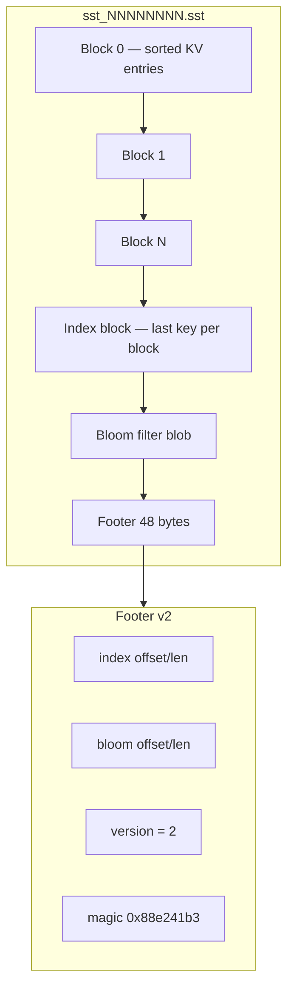

# SSTable design

I chose an immutable sorted file format similar to LevelDB/RocksDB block tables — not because I wanted compatibility, but because the layout is well documented and easy to validate with hex dumps.

## File layout




## Write path

1. Iterate memtable in key order.
2. Fill 4 KiB blocks (default `defaultBlockSize`).
3. Build index (last key per block).
4. Encode bloom from expected entry count.
5. Write footer.
6. Rename from `.tmp` to final path only on successful `Close`.

Manifest learns about the file only after rename — readers never see partial SSTs.

## Entry format (inside blocks)

```
keyLen(4) | key | valueLen(4) | value | tombstone(1)
```

Keys strictly increase. Tombstone byte `1` means delete.

## Read path

1. Read footer from end of file (fixed 48 bytes).
2. Validate magic and version.
3. Load bloom → `MayContain` gate.
4. Binary search index for block boundary.
5. Load block (optionally from LRU cache).
6. Scan block entries.

## Reader reference counting

`Ref`/`Unref` gate `Close` of the underlying file.

## Block cache

Optional LRU (`Options.BlockCacheSize`, default 32 MiB). Cache key includes path + offset (I fixed a collision bug where reused paths served stale blocks).

## Bloom filter

Built at write time with target false positive rate 1%. Stored between index and footer. Decode rejects `m==0` or `k==0` to avoid panics on corrupt files — commit `054e6f7`.

## Limits I accept

- No compression (Snappy/Zstd deferred)
- No partitioned index/filter
- No table properties collection
- Whole-block read even for small values
