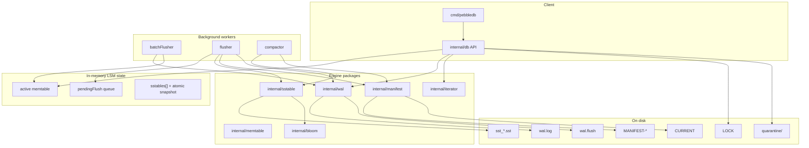

# System overview

I built PebbleDB as a single-node embedded LSM key-value store in Go — not a fork of RocksDB or CockroachDB's Pebble.

## What PebbleDB is

| Property | Value |
|----------|-------|
| API | `Open`, `Close`, `Put`, `Get`, `Delete`, `Scan`, `Sync` |
| Key type | `[]byte`, lexicographic order |
| Durability | WAL + manifest-tracked SSTables |
| Concurrency | Single writer (`db.mu`), concurrent `Get`/`Scan` with snapshots |
| Process model | One process per database directory (`LOCK` file) |

No replication, transactions, MVCC, column families, or network server.

## Layered architecture




## Operation matrix

| Operation | Touches | Durability boundary |
|-----------|---------|---------------------|
| Put/Delete (async) | pendingBatch → WAL batch → memtable | WAL fsync in batchFlusher (not always before return) |
| Put/Delete (`SyncWrites`) | WAL fsync per op | WAL fsync |
| `Sync()` | drains pendingBatch + in-flight WAL batch | WAL fsync |
| Flush | SST file + manifest | `manifest.AppendNewFile` fsync |
| Compaction | merged SST + manifest | `manifest.SetFileSet` fsync |
| Get | memtables + SST readers | none (read-only) |
| Scan | snapshots + SST iterators | none (point-in-time at creation) |

## On-disk layout

```
data/
├── LOCK                 # exclusive open (flock / LockFileEx)
├── CURRENT              # active manifest filename
├── MANIFEST-000001      # append-only live SST set log
├── wal.log              # append-only WAL
├── wal.flush            # transient flush checkpoint (usually absent)
├── quarantine/          # orphan SST files moved on open
└── sst_00000001.sst     # immutable sorted runs
```

## Package dependency graph

```
cmd/pebbledb → internal/db → {wal, memtable, sstable, manifest, iterator}
                                    sstable → bloom
```

No import cycles. I test packages in isolation before wiring `internal/db`.

## Background workers

| Worker | Trigger | Responsibility |
|--------|---------|----------------|
| `batchFlusher` | timer (1ms), batch size, memtable pressure | `AppendBatch` + fsync, apply to memtable |
| `flusher` | `flushCh` (coalesced) | drain entire `pendingFlush` queue per wakeup |
| `compactor` | `compactCh`, `compactMu` | merge oldest 2 SSTs while count ≥ threshold |
