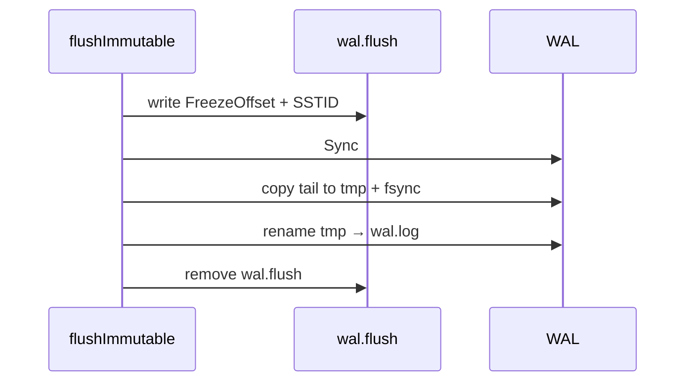

# WAL design

The WAL is append-only durability before memtable apply. I keep the format deliberately simple — one `wal.log` file, CRC per record, no segment directory.

## Record format

```
keyLen(4 BE) | key | valueLen(4 BE) | value | tombstone(1) | crc32(4 BE)
```

CRC32-IEEE over preceding bytes.

## API surface

| Method | Behavior |
|--------|----------|
| `Append` | single record + implicit batching at caller |
| `AppendBatch` | multiple records, one `Sync` at end |
| `Sync` | fsync |
| `TruncateBefore` | atomic tail retention |
| `Replay` / `ReplayFromWithRecovery` | verify CRC, salvage partial tail |

## Group commit integration

`batchFlusher` calls `AppendBatch` then `Sync` once per batch. This is the default write durability path.

## Truncation

After flush, bytes `[0, FreezeOffset)` are redundant with SST content. `TruncateBefore`:

1. `Sync` current file.
2. Copy `[offset, EOF)` to `wal.truncate.tmp`.
3. Fsync temp, close handles.
4. Atomic rename replaces `wal.log`.

I verify copied byte count — `ErrTruncateIncomplete` if short read/write.




Early truncation on Windows failed when file handles stayed open — commit `78e8eb8` (`close, truncate, reopen`).

## Replay limits

Defaults (`internal/wal/limits.go`):

| Limit | Value |
|-------|-------|
| Max WAL size | 64 MiB |
| Max key | 1 MiB |
| Max value | 16 MiB |

Oversized records fail replay instead of allocating unbounded buffers.

## Rejected alternatives

| Alternative | Why rejected |
|-------------|--------------|
| In-place truncate without copy | Windows file locking + crash safety |
| Memtable apply before WAL fsync | breaks crash recovery |
| Multiple WAL segments | complexity not needed at this scale |
