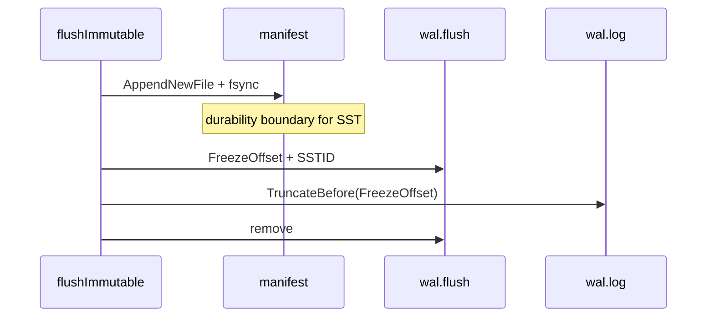

# WAL design

The write-ahead log (`wal.log`) is PebbleDB's first durability layer. Every `Put` and `Delete` eventually becomes a WAL record before it is considered safe across process crash. Format: one file, length-prefixed records, CRC32 per record — no segment directory, no sequence numbers in the payload.

---

## Role in the LSM

In an LSM tree, the WAL answers one question: **if power fails right now, what writes can I reconstruct?** The memtable is fast but volatile. SSTables are durable but batch-written on flush. The WAL bridges the gap between user `Put` and immutable on-disk runs.

PebbleDB's ordering rule (see [INVARIANTS.md](../design/INVARIANTS.md) D1):

1. Append record(s) to WAL.
2. `fsync` the WAL (per batch in the common case).
3. Apply records to the active memtable.

Memtable apply runs only after WAL fsync succeeds. On `AppendBatch` failure, `flushPendingBatch` restores the batch to `pendingBatch` and does not apply.

The WAL is **not** the only durable store after flush. Once memtable bytes are captured in an SST and the manifest commits, prefix bytes in the WAL become redundant. Bounded replay (`wal.flush` checkpoint) is how I avoid re-applying flushed data — see [RECOVERY.md](RECOVERY.md).

---

## Record format

Each record is self-contained:

```
keyLen   (4 bytes, big-endian uint32)
key      (keyLen bytes)
valueLen (4 bytes, big-endian uint32)
value    (valueLen bytes)
tombstone(1 byte: 0 = put, 1 = delete)
crc32    (4 bytes, CRC32-IEEE over all preceding bytes)
```

Deletes set `tombstone = 1`; `value` is typically empty but the field is still present on wire.

Encoding lives in `internal/wal/wal.go` (`encodeRecord`, `readOneRecord`). CRC mismatch on replay fails open — I do not silently skip bad records in the middle of the file (tail salvage only).

### Replay limits

`ReplayLimits` (`internal/wal/limits.go`) cap resource use during untrusted disk reads:

| Limit | Default |
|-------|---------|
| Max WAL file size | 64 MiB |
| Max key size | 1 MiB |
| Max value size | 16 MiB |

Oversized length fields return `ErrKeyTooLarge` / `ErrValueTooLarge` instead of allocating attacker-controlled buffers.

---

## API surface

| Method | Behavior |
|--------|----------|
| `Append` | Single record; no implicit fsync (caller batches) |
| `AppendBatch` | Sequential append of many records, **one** `fsync` at end |
| `Sync` | `fsync` only |
| `Size` / `Offset` | File size and write cursor |
| `TruncateBefore` | Copy tail to temp file, fsync, atomic rename |
| `Replay` / `ReplayFromWithRecovery` | Read from offset; salvage partial tail |

`AppendBatch` failure semantics: if any write or final `Sync` fails, the batch is not durable. Callers must not apply those records to memtable. `flushPendingBatch` obeys this.

---

## Integration with group commit

Default writes do not call `wal.Append` from the user goroutine directly. Path:

1. `Put` / `Delete` → `writeRecord` → append `ownedRecord` to `pendingBatch`.
2. `scheduleBatchFlushLocked` starts or resets a **1ms** timer (`batchFlushDelay`).
3. Flush triggers when any of: `syncWrites`, `len(pendingBatch) >= 64`, `batchSizeBytes >= 16 KiB`, or active memtable would exceed `MemtableSize` with pending bytes counted.
4. `batchFlusher` goroutine calls `flushPendingBatch` → `wal.AppendBatch` + memtable apply.

`awaitBatchPersist()` (used by `Sync()` and sync-triggered puts) sends work to `batchFlusher` via `batchSyncCh` and blocks until that flush completes. This serializes WAL persistence through one goroutine, avoiding concurrent `AppendBatch` calls.

### Durability levels exposed to callers

| API | Guarantee when call returns |
|-----|----------------------------|
| `Put` (default) | Record queued; may not be fsynced |
| `Sync()` | All records in `pendingBatch` at call time are fsynced |
| `SyncWrites: true` | Each qualifying write waits for batch persist |
| `Close()` | Best-effort full drain (see shutdown invariants) |

Group commit yielded ~20× higher sequential write throughput than per-op fsync (commit `01eef8e`). Async is the default; durability requires `Sync()` or `SyncWrites` ([TRADEOFFS.md](../design/TRADEOFFS.md)).

### Failure mode: concurrent puts during WAL fsync

While `batchFlusher` fsyncs a taken batch, other goroutines may append to a new `pendingBatch`. After fsync, assign `pendingBatch = batch[:0]` only when `len(pendingBatch) == 0` (`batch.go`). `TestRapidPutNoLossDuringAsyncFlush` guards this.

---

## Truncation after flush

When the active memtable is flushed to SST `sst_NNNNNNNN`, WAL bytes `[0, walCutoff)` correspond to records now in that SST. Keeping them wastes space and breaks replay (duplicate application). `completeWalAfterFlush`:

1. `writeWalFlushState` → `wal.flush` (16 bytes: `FreezeOffset` + `SSTID`), fsync + rename.
2. `wal.TruncateBefore(walCutoff)`.
3. `removeWalFlushState`.

`walCutoff` is captured as `wal.Size()` at memtable swap time in `maybeFlushLocked`.

### TruncateBefore algorithm

In-place truncate of the head with the file handle still open was rejected — especially on Windows (`78e8eb8`).

1. `Sync` current WAL.
2. Copy `[truncateAt, EOF)` to `wal.log.truncate.tmp`.
3. Fsync temp; verify byte count (`ErrTruncateIncomplete` on short copy).
4. Close WAL handle; atomic rename temp → `wal.log`.
5. Reopen for append.

A crash mid-truncate leaves either the old WAL (safe, full replay) or the new shorter WAL. Combined with `wal.flush` logic, reopen picks the correct replay offset — see [RECOVERY.md](RECOVERY.md).



---

## Replay semantics

### Full replay

`ReplayWithLimits(path, limits, fn)` replays from offset 0. Used conceptually on first open without checkpoint; production open uses `ReplayFromWithRecovery` with computed start offset.

### Bounded replay

`ReplayFromWithRecovery(path, limits, startOffset, fn)`:

- Seeks to `startOffset` (clamped to file size).
- Reads records until EOF.
- On `io.ErrUnexpectedEOF` at record boundary: **truncate file to last valid byte** and succeed.

This salvage handles crash mid-record append — the partial record is discarded.

### Interaction with `wal.flush`

`walReplayStartOffset()` (`internal/db/wal_state.go`):

| Condition | Start offset |
|-----------|--------------|
| No `wal.flush` | 0 |
| `SSTID` not in manifest | 0 (ignore stale checkpoint) |
| `FreezeOffset < 0` | 0 |
| `wal.size < FreezeOffset` | 0 (truncated below freeze; tail is entire logical log) |
| Else | `FreezeOffset` |

The third row is subtle: crash after truncate but before removing `wal.flush` leaves a short WAL. Replaying from 0 on the short file is correct because flushed prefix is gone and SST holds that data.

`TestWalReplayStartOffsetWhenWalTruncatedBelowFreeze` covers the `wal.size < FreezeOffset` case ([wal-replay-bug](../postmortems/wal-replay-bug.md)).

---

## Crash boundaries (write path)

| Crash point | State on disk | After reopen |
|-------------|---------------|--------------|
| After memtable apply, before WAL fsync | Memtable may have record; WAL may not | **Violation of D1** if apply happened — prevented by ordering |
| After WAL fsync, before memtable apply | WAL has record | Replay applies to memtable |
| Mid `AppendBatch` | Partial tail record | Tail salvaged/truncated |
| After flush manifest, before `wal.flush` | SST live; full WAL | Replay from 0; duplicate in memtable + SST — read path merges by layer order |
| After `wal.flush`, before truncate | Checkpoint + full WAL | Replay from `FreezeOffset` |
| After truncate | Short WAL | Replay from 0 on short file |

Subprocess crash tests: `flush_after_manifest`, `flush_after_wal_state`, `flush_after_wal_truncate` (`crash_recovery_test.go`).

---

## Failure modes

| Failure | System response |
|---------|-----------------|
| WAL `AppendBatch` IO error | Batch restored to `pendingBatch`; background WAL error; writes block |
| WAL exceeds `MaxFileSize` on replay | `Open` fails with `ErrWALTooLarge` |
| CRC error mid-file | Open fails (no silent skip) |
| Truncate copy incomplete | `ErrTruncateIncomplete`; flush error logged; data still durable via SST |
| Disk full on fsync | Propagates to caller / background error |

---

## Rejected alternatives

| Alternative | Why rejected |
|-------------|--------------|
| Memtable apply before WAL fsync | Crash loses acknowledged-in-memory data; breaks D1 |
| In-place WAL head truncate | Windows locking; crash can corrupt file if not copy-rename |
| Multiple WAL segment files | Directory rotation, segment discovery, and cross-segment truncate — out of scope |
| Per-record LSN in WAL payload | Heavier format; `wal.flush` byte offset was enough |
| Group commit without timer | Higher latency for low-QPS workloads; 1ms timer batches small writes |
| No CRC | Silent corruption on replay |
| Delete WAL on flush instead of truncate | Loses records for memtable still only in WAL tail |

---

## Durability phases

Each record moves through three states:

1. **Queued** — in `pendingBatch` (volatile).
2. **Logged** — fsynced in `wal.log` (crash-safe).
3. **Redundant** — captured in live SST; prefix eligible for truncate after checkpoint.

Missing-key debug order: pending batch → WAL → memtable → SST → manifest.
