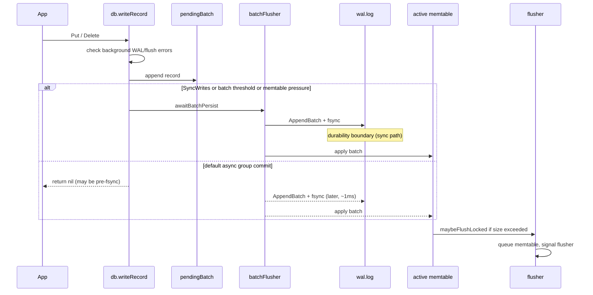

# Write path

I designed the write path around one constraint: **WAL fsync must precede memtable apply** so a crash after fsync can always replay into memtable. Everything else — group commit, flush triggers, sync modes — is optimization and API contract.

## Put / Delete flow

## Group commit (default)

I introduced group commit in commit `01eef8e` after measuring per-write fsync latency. Default path:

1. Append to `pendingBatch` under `db.mu`.
2. Schedule `batchFlusher` (1ms timer).
3. Return `nil` — **not** a durability guarantee.

Thresholds that force synchronous persist in the caller goroutine:

| Threshold | Value |
|-----------|-------|
| `batchFlushDelay` | 1 ms |
| `batchMaxRecords` | 64 |
| `batchMaxBytes` | 16 KiB |
| Memtable pressure | `active.Size() + batch > MemtableSize` |

## Sync modes

| Mode | When I use it |
|------|----------------|
| Default async | Throughput benchmarks, bulk load |
| `DB.Sync()` | Explicit barrier after a batch of puts |
| `Options.SyncWrites` | CLI `-sync-writes`, tests that need per-op durability |

I added `Sync()` and `SyncWrites` in commit `0a7a5fa` because returning `nil` from `Put` without fsync was correct internally but misleading to callers.

## Memtable flush trigger

When `active.Size() > MemtableSize` (default 4 MiB):

1. Record `walCutoff = wal.Size()` — byte offset at end of WAL for this memtable.
2. Append active skip list to `pendingFlush`.
3. Replace `active` with empty skip list.
4. Signal flusher (non-blocking send on buffered channel).

I use **size** not entry count because variable-length values break count-based thresholds.

## Write blocking policy

| Background error | Put/Delete | Get/Scan |
|------------------|------------|----------|
| WAL | blocked | allowed |
| Flush (default) | blocked | allowed |
| Compaction | not blocked | allowed |

I rejected blocking reads on flush failure — existing SST + memtable data remains servable.

## Rejected alternatives

| Alternative | Why I rejected it |
|-------------|-------------------|
| Memtable before WAL | Crash loses acknowledged writes even after fsync story breaks |
| Per-write fsync only | ~20× lower write throughput in my measurements |
| Multiple active memtables without queue | Second flush while first runs lost entries before `pendingFlush` queue |
