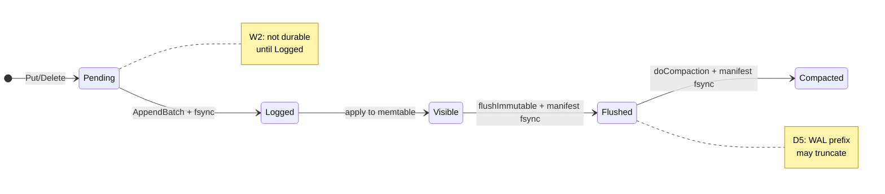
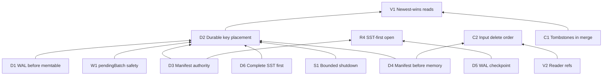

# System invariants

Properties PebbleDB must maintain across crash, concurrent reads, and background compaction. Grouped by concern: **durability** (power loss), **visibility** (caller observations), **concurrency** (parallel goroutines).

The sections below define what correctness means for this engine. The invariant catalog (D*, V*, W*, C*, R*, S*) is the enforcement checklist; each entry maps to code, tests, and crash windows.

---

# Correctness Goal

PebbleDB is a single-node embedded LSM. Correctness here means: **after a successful durability boundary, acknowledged user data survives process crash and power loss, and reads observe a coherent newest-wins view across memtable and SST layers.**

Collectively the invariants enforce:

| Guarantee area | What “correct” means |
|----------------|----------------------|
| **Durability after acknowledged writes** | After `Sync()`, `SyncWrites`, or `awaitBatchPersist()` completes, records are in `wal.log` with `fsync` before memtable apply (D1). After `Close()` succeeds, flushed data is in manifest-backed SSTs (D2–D4, D6). |
| **Crash recovery** | `Open` reconstructs state from manifest + bounded WAL replay without requiring orphaned files or directory glob (D3, D5, R2–R4). |
| **Visibility** | `Get` and `Scan` resolve keys in layer order; tombstones mask older versions (V1, V3). In-process read-your-writes holds for `pendingBatch` (V1). |
| **Compaction safety** | Merged output is manifest-committed before inputs are dropped; in-flight readers are not closed under refs (C1, C2, V2). |
| **Manifest authority** | Live SST set is exactly what manifest replay reports; disk files are not live until manifest says so (D3, D4). |
| **Reader safety** | SST `Reader` handles stay open until `Ref` count reaches zero after logical removal (V2). |

What correctness does **not** claim is listed in [Properties PebbleDB Does Not Guarantee](#properties-pebbledb-does-not-guarantee). Failure assumptions are in [Failure Assumptions](#failure-assumptions).

---

# System Model

## Source of truth (durable on disk)

| Artifact | Role |
|----------|------|
| **`wal.log`** | Append-only log of puts and deletes. Authoritative for records not yet captured in a flushed SST prefix, and for all records between last flush and crash when checkpoint is absent. |
| **`MANIFEST-*` + `CURRENT`** | Authoritative **live SST id set**. An `sst_*.sst` file is not readable as live data unless its id appears in manifest replay. |
| **`sst_*.sst`** | Immutable sorted runs. Content is authoritative **only** when referenced by manifest. Complete files with valid footer exist on disk before manifest learns them (D6). |
| **`wal.flush`** (transient) | Checkpoint metadata: `{FreezeOffset, SSTID}`. Not user data; bounds WAL replay after flush. Absent after successful truncate. |

## Ephemeral state (process memory; lost on crash)

| State | Contents | Survives crash? |
|-------|----------|-----------------|
| **`pendingBatch`** | Records queued for group commit, not yet WAL-fsynced | **No** — unless recovered indirectly via WAL on reopen (records never reached WAL are lost) |
| **`active` memtable** | Sorted in-memory writes applied after WAL batch | **Partially** — reconstructed from WAL replay into fresh `active` on `Open` |
| **`pendingFlush` queue** | Immutable memtables waiting for `flushImmutable` | **No** — data remains in WAL; replay rebuilds `active` |
| **`db.sstables` / atomic snapshot** | In-memory reader list mirroring manifest | **No** — rebuilt from manifest on `Open` |
| **Block cache** | Hot SST blocks | **No** |
| **Background worker queues** | `batchFlushCh`, `flushCh`, `compactCh` signals | **No** |

## Distinction

On crash, only **WAL bytes**, **manifest records**, and **manifest-referenced SST files** are trusted. Everything in the ephemeral table is rebuilt or discarded. `pendingBatch` without prior `fsync` is intentionally not durable (W2). `Close()` attempts to move all memtable data through flush into manifest-backed SSTs before exit (S1, D2).

See [WRITE_PATH.md](../architecture/WRITE_PATH.md), [RECOVERY.md](../architecture/RECOVERY.md), [MANIFEST_DESIGN.md](../architecture/MANIFEST_DESIGN.md).

---

# Write Lifecycle

A single `Put`/`Delete` moves through states. Boundaries between states are where crash tests aim.

| State | Where data exists | Durable? | Visible to `Get`? | After crash + `Open` |
|-------|-------------------|----------|-------------------|----------------------|
| **Pending** | `pendingBatch` only | No | Yes (in-process via `lookupPendingBatch`) | Lost if never reached WAL |
| **Logged** | `wal.log` (fsynced), not yet memtable | Yes | Yes after memtable apply in same process; on reopen via replay | Replay applies to `active` |
| **Visible** | `active` or `pendingFlush` memtable (+ possibly WAL) | WAL yes; memtable alone no | Yes | WAL tail + SST layers |
| **Flushed** | Live SST + WAL tail past checkpoint | Yes (SST via manifest fsync) | Yes | SST loaded; WAL replay from offset |
| **Compacted** | Merged SST in manifest; inputs discarded after refs drain | Yes | Yes | Manifest live set only |

Async `Put` may return in **Pending** before **Logged**. `Sync()` forces transition to **Logged** for queued records.



Enforced by: `batch.go` (Pending→Logged→Visible), `flush.go` (Visible→Flushed), `compactor.go` (Flushed→Compacted). See [WAL_DESIGN.md](../architecture/WAL_DESIGN.md), [COMPACTION.md](../architecture/COMPACTION.md).

---

# Invariant Dependency Graph

Some invariants are primitive; others are composite correctness properties.

**D2** (durable key placement) is the central durability property. It holds when:

- **D1** ensures logged bytes precede memtable apply.
- **W1** ensures pending queue is not dropped during async flush.
- **D3 + D4 + D6** ensure flushed bytes live in manifest-backed SSTs with correct ordering.
- **S1** ensures `Close` drains ephemeral state into durable layers.

**R4** (SST-first open) depends on **D3** (which SSTs to load) and **D5** (where WAL replay starts).

**C2** (safe input deletion) depends on **D4** (manifest commit before memory swap) and **V2** (no close under refs).



Local guarantees compose: without D4, D3 can disagree with `db.sstables` after crash; without V2, C2 can close handles under active `Get`; without D5, R4 may replay flushed WAL bytes into memtable ([wal-replay-bug](../postmortems/wal-replay-bug.md)).

---

# Properties PebbleDB Does Not Guarantee

Explicit non-goals and API boundaries:

| Not guaranteed | Detail |
|----------------|--------|
| **Multi-process consistency** | `LOCK` enforces one writer process (R1). No cross-process cache coherence. |
| **Transactions** | No atomic multi-key commit or rollback across keys. |
| **Snapshot isolation / MVCC** | `Scan` is point-in-time at creation (V3), not a versioned snapshot across time. No read timestamps. |
| **Distributed replication** | Single node only. No leader election, no quorum. |
| **Durability before `Sync()`** | Default async `Put` may return while records sit in `pendingBatch` (W2). |
| **Durability if `fsync` lies** | Design assumes the OS/storage stack honors `fsync`/`fdatasync`. Silent write-back cache violations are out of scope. |
| **Immediate compaction** | Compaction is background; SST count can exceed threshold temporarily. Failures retry without blocking writes (C3). |
| **Read-after-flush for iterators** | `Scan` does not see keys flushed after iterator creation. |
| **Bounded read amplification** | Oldest-2 compaction does not minimize read amp. |
| **Production multi-tenant SLOs** | Educational scope; see [TRADEOFFS.md](TRADEOFFS.md). |

---

# Failure Assumptions

## In scope (design expects survival)

| Failure | Expected behavior |
|---------|-------------------|
| **Process crash / `kill -9`** | Reopen via manifest + WAL replay (R4, D5). |
| **Panic in user goroutine** | Same as crash if process exits; no special panic handler. |
| **Power loss after `fsync`** | Durable records in WAL/manifest survive. |
| **Partial WAL tail record** | Salvage: truncate to last valid CRC (R3). |
| **Crash during flush** | Manifest-before-memory: SST live after manifest fsync even if WAL truncate incomplete (D4, D5 crash table). |
| **Crash during compaction** | Manifest `SetFileSet` defines live set; orphans quarantined (C2, R2). |
| **Crash during manifest append/rotation** | Tail salvage on manifest; `CURRENT` updated only after fsync ([manifest-consistency](../postmortems/manifest-consistency.md)). |
| **Concurrent `Get`/`Scan` during compaction** | Refcounted readers (V2). |
| **Second `Open` on same dir** | `ErrDatabaseLocked` (R1). |

## Out of scope

| Failure | Why out of scope |
|---------|------------------|
| **Malicious or buggy filesystem** | Returns success without persisting, reorders visible data arbitrarily. |
| **Silent storage corruption** | Bit rot returning wrong bytes with valid CRC by chance — not cryptographically verified. |
| **Silent memory corruption** | No checksums on in-memory structures. |
| **Two processes bypassing `LOCK`** | Undefined behavior; WAL interleaving corrupts both. |
| **Attacker-controlled unlimited WAL** | Mitigated by `ReplayLimits` (R3) but not a full DoS hardening story. |

Crash injection points: `PEBBLEDB_CRASH_AT` in `internal/db/crashpoint.go`. See [CRASH_TESTING.md](../testing/CRASH_TESTING.md).

---

## Durability and authority

### Invariant D1 — Acknowledged writes are in the WAL before memtable apply

After `awaitBatchPersist()` or `Sync()` returns successfully, every record in the flushed batch has been appended to `wal.log` and `fsync` has completed. Memtable apply happens only after WAL append succeeds.

If memtable were updated before WAL fsync, a crash would lose data the client believed was written.

**Violation symptom.** Keys visible in memtable after restart but absent from WAL replay.

**Enforced by.** `flushPendingBatch()` in `internal/db/batch.go`: `AppendBatch` then apply loop. `restorePendingBatchLocked` on WAL failure.

**Crash boundary.** Between WAL append and memtable apply: safe — replay reconstructs memtable on open.

**Related.** D2, W1 · [WAL_DESIGN.md](../architecture/WAL_DESIGN.md) · [WRITE_PATH.md](../architecture/WRITE_PATH.md) · `TestSyncPersistsPendingBatch`, `TestWalAppendFailurePreservesPendingBatch` (`durability_test.go`, `close_test.go`)

---

### Invariant D2 — A user-visible key exists in WAL or a live SST (or both)

For any key that `Get` would return (non-tombstone) at a logical point in time after successful `Sync()` or `Close()`:

- The key appears in `wal.log` at some offset, **or**
- The key appears in an SSTable whose id is in the manifest live set, **or**
- The key is in `active` / `pendingFlush` memtables that will be flushed before shutdown completes.

Before `Sync()`, async group commit may leave keys only in `pendingBatch` (not yet durable). That is an explicit API contract, not a violation.

This is the definition of durability for an LSM: the log plus immutable files are the source of truth.

**Violation symptom.** `Get` succeeds, crash, reopen → `ErrNotFound` with no WAL record and no SST entry.

**Enforced by.** WAL-before-memtable ordering; manifest-before-memory on flush/compaction; `Close` drains pending flush.

**Related.** D1, D3, D4, D5, D6, W1, W2, S1 · [RECOVERY.md](../architecture/RECOVERY.md) · [wal-replay-bug](../postmortems/wal-replay-bug.md) · `TestCrashRecoveryFlushAfterManifest`, `TestCrashRecoveryCompactAfterManifest`

---

### Invariant D3 — Manifest is authoritative for the live SST set

An `sst_XXXXXXXX.sst` file on disk is **live** if and only if its id is in the manifest live set after replay. Directory glob, file mtime, or in-memory `db.sstables` alone do not define liveness.

Orphan SSTs after compaction crash confused recovery when discovery used directory glob.

**Violation symptom.** Disk has SST files not in manifest; `Get` misses keys that exist only in orphans. Or manifest lists ids with missing files → open error.

**Enforced by.** `loadSSTables()` loads only manifest ids; `removeOrphanSSTFiles()` quarantines extras; compaction uses `AppendSetFileSet` before swapping memory.

**Crash boundary.** Manifest record fsync is the moment a new SST becomes durable and live.

**Related.** D2, D4, D6, R2, R4 · [MANIFEST_DESIGN.md](../architecture/MANIFEST_DESIGN.md) · [manifest-consistency](../postmortems/manifest-consistency.md) · `manifest_test.go`, `TestManifestIgnoresOrphanSSTAfterCompactionCrash`, `TestOrphanSSTQuarantined`

---

### Invariant D4 — Manifest fsync precedes in-memory SST set update (flush and compaction)

For flush: `manifest.AppendNewFile(id)` + fsync completes before `db.sstables` is updated.

For compaction: `manifest.AppendSetFileSet(liveIDs)` + fsync completes before `db.sstables` is replaced.

Memory-first ordering created windows where the process believed old SSTs were gone but manifest still listed them — or the reverse.

**Violation symptom.** Post-crash manifest and disk disagree; keys lost or duplicated across layers.

**Enforced by.** `flushImmutable`, `doCompaction` in `internal/db/flush.go` and `compactor.go`.

**Rollback.** If compaction picks readers that are invalidated before manifest commit, manifest rolls back to `oldLiveIDs` and merged file is deleted.

**Related.** D2, D3, D6, C2 · [MANIFEST_DESIGN.md](../architecture/MANIFEST_DESIGN.md) · [COMPACTION.md](../architecture/COMPACTION.md) · [manifest-consistency](../postmortems/manifest-consistency.md) · `TestCrashRecoveryFlushAfterManifest`, `TestCrashRecoveryCompactAfterManifest`, `TestFlushWritesManifestRecord`

---

### Invariant D5 — WAL bytes before `FreezeOffset` are redundant with a flushed SST

When `wal.flush` exists and `walReplayStartOffset()` returns `FreezeOffset`:

- SST `SSTID` from the checkpoint is in the manifest live set.
- `wal.log` size ≥ `FreezeOffset`.
- All user records in WAL `[0, FreezeOffset)` are represented in that SST (or superseded by tombstones in that SST).

After successful truncate, `wal.flush` is removed and replay starts at offset 0 on the shorter file.

Defines the legal WAL replay range after restart.

**Violation symptom.** Duplicate keys in memtable + SST; stale values shadowing newer SST data.

**Enforced by.** Flush ordering: manifest commit → `writeWalFlushState` → `TruncateBefore` → `removeWalFlushState`. Open logic in `wal_state.go`.

**Crash windows.**

| Crash after | On reopen |
|-------------|-----------|
| Manifest commit, before `wal.flush` | Full WAL replay; SST also has data — duplicates possible in memtable until read path merges correctly; replay offset 0 |
| `wal.flush` written, before truncate | Replay from `FreezeOffset`; correct |
| Truncate done, before remove `wal.flush` | `wal.size < FreezeOffset` → replay from 0; correct |
| Truncate + remove `wal.flush` | Replay from 0 on short WAL; correct |

**Related.** D2, R4 · [WAL_DESIGN.md](../architecture/WAL_DESIGN.md) · [RECOVERY.md](../architecture/RECOVERY.md) · [wal-replay-bug](../postmortems/wal-replay-bug.md) · `wal_state_test.go` · `TestCrashRecoveryFlushBoundaries` (`flush_after_manifest`, `flush_after_wal_state`, `flush_after_wal_truncate`)

---

### Invariant D6 — SST files are complete before manifest learns them

An SST is written to a temp path pattern (`sst_%08d.sst` via writer), fully closed (footer + bloom), opened as `Reader`, then manifest is updated. Partial files are not appended to manifest.

Crash mid-write must not produce a live corrupt SST.

**Violation symptom.** Manifest references id; file truncated or bad footer → open fails.

**Enforced by.** `sstable.Writer` writes to path only after successful `Close`; flush removes file on manifest failure.

**Related.** D2, D3, D4 · [SSTABLE_DESIGN.md](../architecture/SSTABLE_DESIGN.md) · `flush_after_sst_close` crash point · `TestFlusher` (`flush_test.go`)

---

## Visibility and read path

### Invariant V1 — Get observes newest visible version across layers

Search order: `pendingBatch` (newest record per key) → `active` memtable → `pendingFlush` memtables (newest first) → SST readers (newest first). Tombstones mask older values.

Defines linearizability of reads relative to completed writes.

**Violation symptom.** `Get` returns deleted value; older SST shadows newer memtable entry.

**Enforced by.** `get.go` ordering; tombstone byte in WAL and SST blocks.

**Related.** D2, C1, W2 · [READ_PATH.md](../architecture/READ_PATH.md) · `get_test.go`, `TestDBPutGet`, `TestGetSeesUnflushedPendingBatchWithoutFsync`

---

### Invariant V2 — Compaction does not close a reader still referenced by an in-flight Get or Scan

Compaction calls `Discard()` on input readers; physical `Close` happens only when `Ref()` count reaches zero.

Immutable SSTs are still readable while a goroutine holds a ref.

**Violation symptom.** Race detector failure; `os.ErrClosed` during block read; Windows delete while handle open.

**Enforced by.** `Ref`/`Unref` in `get.go` and `scan.go`; `readersStillPresent` in compaction. [compaction-race](../postmortems/compaction-race.md), [reader-lifecycle](../postmortems/reader-lifecycle.md).

**Related.** C2 · [COMPACTION.md](../architecture/COMPACTION.md) · [CONCURRENCY_MODEL.md](../architecture/CONCURRENCY_MODEL.md) · `TestGetSurvivesCompactionWithHeldRefs`, `TestLookupSSTReadersSkipsClosed` · `go test -race ./...`

---

### Invariant V3 — Scan iterators see a snapshot at creation time

`Scan` copies memtable state under lock (active + pending batch snapshot + pending flush list) and pins SST readers with `Ref`. Writes after iterator creation are not required to appear in the scan.

Avoids holding `db.mu` for the entire scan; defines iterator isolation semantics.

**Violation symptom.** Scan blocked all writes (old design); or scan sees torn interleaved writes (if lock too short without copy).

**Enforced by.** `scan.go` snapshot path. [scan-lock-contention](../postmortems/scan-lock-contention.md).

**Related.** V2 · [READ_PATH.md](../architecture/READ_PATH.md) · `scan_snapshot_test.go` (`TestScanDoesNotBlockWrites`), `TestScanIsPointInTimeSnapshot`

---

## Write path and batching

### Invariant W1 — `pendingBatch` records are not dropped during async flush

If new records are appended to `pendingBatch` while the batch flusher holds an in-flight batch (during WAL `fsync`), those new records must remain queued after flush completes.

`db.pendingBatch = batch[:0]` during concurrent append dropped queued records (384/50000 keys in stress test).

**Violation symptom.** `Get: key not found` for keys where `Put` returned nil; partial dataset after rapid puts.

**Enforced by.** `flushPendingBatch` only reuses slice when `len(db.pendingBatch) == 0`.

**Test.** `TestRapidPutNoLossDuringAsyncFlush` in `flush_test.go`

**Related.** D1, D2 · [WAL_DESIGN.md](../architecture/WAL_DESIGN.md) · [WRITE_PATH.md](../architecture/WRITE_PATH.md)

---

### Invariant W2 — `Put` return does not imply durability unless `SyncWrites` or batch sync path completed

Default: `Put` may return while records sit in `pendingBatch` or before timer-based flush. `Sync()` drains pending batch via `awaitBatchPersist`. `SyncWrites: true` forces persist per qualifying write.

**Enforced by.** `write.go`, `sync.go`, CLI `sync` command.

**Related.** D1, D2 · [WRITE_PATH.md](../architecture/WRITE_PATH.md) · [TRADEOFFS.md](TRADEOFFS.md) · `TestSyncPersistsPendingBatch`, `TestSyncWritesOptionWaitsForFsync`, `TestCLIPutGetSync`

---

## Compaction

### Invariant C1 — Compaction merge preserves tombstones until keys are overwritten

`MergeReadersKeepTombstones` emits tombstone entries. Duplicate keys resolve to the newer file (higher index in `db.sstables`).

Deletes must survive compaction or resurrect after merge.

**Violation symptom.** Deleted keys reappear after compaction.

**Related.** V1 · [COMPACTION.md](../architecture/COMPACTION.md) · `TestCompactionDropsDeletedKeys`, `TestCompactionMergesDuplicateKeys`

---

### Invariant C2 — Input SST files are not deleted until manifest commit succeeds and refs drain

Order: merge to disk → manifest `SetFileSet` + fsync → update `db.sstables` → `Discard` inputs → delete when refs=0.

Crash after manifest commit must not require input files for recovery; crash before commit must leave inputs live.

**Crash test points.** `compact_after_manifest`, `compact_after_delete_old` in `crash_recovery_test.go`

**Related.** D4, V2, D3 · [COMPACTION.md](../architecture/COMPACTION.md) · [compaction-race](../postmortems/compaction-race.md) · `TestCrashRecoveryCompactBoundaries`, `TestCrashRecoveryCompactAfterManifest`

---

### Invariant C3 — Compaction failure does not block writes

Compaction errors set background `compaction` error and retry. Unlike flush, writes continue (read amplification may grow).

Scoped failure model — ingestion vs compaction independence.

**Related.** D2 (partial) · [TRADEOFFS.md](TRADEOFFS.md) · `background_err_test.go` · `TestCompactionDisabledWithNegativeThreshold`

---

## Recovery and open

### Invariant R1 — Single process per database directory

`LOCK` file via `flock` / `LockFileEx`. Second `Open` returns `ErrDatabaseLocked`.

Two processes appending to one WAL corrupts both.

**Related.** [CONCURRENCY_MODEL.md](../architecture/CONCURRENCY_MODEL.md) · `TestOpenRejectsSecondProcessLock` (`durability_test.go`)

---

### Invariant R2 — Orphan SSTs never become live on open

Files matching `^sst_\d{8}\.sst$` not in manifest are moved to `quarantine/`, not loaded.

Forensic preservation without polluting the live set.

**Related.** D3 · [RECOVERY.md](../architecture/RECOVERY.md) · [manifest-consistency](../postmortems/manifest-consistency.md) · `TestOrphanSSTQuarantined`, `TestCrashRecoveryOrphanSSTIgnored`, `TestManifestIgnoresOrphanSSTAfterCompactionCrash`

---

### Invariant R3 — WAL replay is bounded and salvageable

Replay respects `ReplayLimits` (max key/value/file size). Partial tail record at EOF is truncated to last valid checksum.

Corrupt or attacker-controlled WAL must not OOM the process.

**Related.** D5, R4 · [WAL_DESIGN.md](../architecture/WAL_DESIGN.md) · `internal/wal` replay tests

---

### Invariant R4 — `Open` replays WAL only after SST load and offset selection

Sequence: LOCK → manifest → load SSTs → quarantine orphans → `walReplayStartOffset` → replay → open WAL for append.

Early `Open` replayed the full WAL after SST load ([wal-replay-bug](../postmortems/wal-replay-bug.md)).

**Related.** D3, D5, R2 · [RECOVERY.md](../architecture/RECOVERY.md) · `wal_state_test.go` · crash recovery suite

---

## Shutdown

### Invariant S1 — `Close` does not destroy WAL/manifest until workers stop or timeout

On `ErrCloseIncomplete`, abort path keeps WAL and manifest handles open so background goroutines cannot race with nil manifest. [shutdown-ordering](../postmortems/shutdown-ordering.md).

**Related.** D2 · [shutdown-ordering](../postmortems/shutdown-ordering.md) · `close_test.go`, `TestCloseIncompleteWhenWalSizeFails`

---

## Invariant summary table

| ID | Statement | Primary enforcement |
|----|-----------|-------------------|
| D1 | WAL fsync before memtable apply | `batch.go` |
| D2 | Durable keys in WAL ∪ live SSTs | D1 + D3 + D4 |
| D3 | Manifest defines live SST set | `manifest.go`, `loadSSTables` |
| D4 | Manifest fsync before memory swap | `flush.go`, `compactor.go` |
| D5 | WAL prefix redundant after checkpoint | `wal_state.go`, truncate |
| D6 | Complete SST before manifest | `sstable.Writer`, flush |
| V1 | Newest-wins read ordering | `get.go` |
| V2 | No close of referenced readers | `Ref`/`Discard` |
| V3 | Scan snapshot isolation | `scan.go` |
| W1 | No pendingBatch loss on flush | `batch.go` |
| W2 | Async Put ≠ durable | `sync.go`, docs |
| C1 | Tombstones survive merge | `MergeReadersKeepTombstones` |
| C2 | Delete inputs after manifest | `compactor.go` |
| C3 | Compaction errors scoped | `background_err` |
| R1 | One process per dir | `dir_lock_*.go` |
| R2 | Orphans quarantined | `removeOrphanSSTFiles` |
| R3 | Bounded WAL replay | `wal/limits.go` |
| R4 | SST-first open | `db.go` Open |
| S1 | Bounded shutdown | `close.go` |

---

# Verification Matrix

Per-invariant mapping for audits. Race column lists targeted tests; full suite is `go test -race -shuffle=on ./...` on Linux/macOS CI.

| Invariant | Code location | Unit / integration tests | Crash tests (`PEBBLEDB_CRASH_AT`) | Race tests |
|-----------|---------------|--------------------------|-----------------------------------|------------|
| D1 | `internal/db/batch.go` | `TestSyncPersistsPendingBatch`, `TestWalAppendFailurePreservesPendingBatch` | — | — |
| D2 | `batch.go`, `flush.go`, `compactor.go`, `close.go` | `TestCrashRecoveryFlushAfterManifest`, `TestCrashRecoveryCompactAfterManifest` | `flush_after_manifest`, `compact_after_manifest` | — |
| D3 | `internal/manifest/`, `db.go` `loadSSTables` | `manifest_test.go`, `TestManifestIgnoresOrphanSSTAfterCompactionCrash`, `TestFlushWritesManifestRecord` | `compact_after_manifest` | — |
| D4 | `flush.go` `flushImmutable`, `compactor.go` `doCompaction` | `TestFlushWritesManifestRecord` | `flush_after_manifest`, `compact_after_manifest`, `compact_after_sstables_update` | — |
| D5 | `wal_state.go`, `flush.go` `completeWalAfterFlush` | `wal_state_test.go` (offset edge cases) | `flush_after_wal_state`, `flush_after_wal_truncate` | — |
| D6 | `internal/sstable/writer.go`, `flush.go` | `TestFlusher` | `flush_after_sst_close` | — |
| V1 | `get.go` | `TestDBPutGet`, `TestGetSeesUnflushedPendingBatchWithoutFsync`, `get_test.go` | — | — |
| V2 | `get.go`, `scan.go`, `sstable.Reader` Ref/Discard | `TestGetSurvivesCompactionWithHeldRefs`, `TestLookupSSTReadersSkipsClosed` | `compact_after_delete_old` | `go test -race ./...` |
| V3 | `scan.go` | `TestScanDoesNotBlockWrites`, `TestScanIsPointInTimeSnapshot`, `scan_test.go` | — | `TestScanDoesNotBlockWrites` under `-race` |
| W1 | `batch.go` `flushPendingBatch` | `TestRapidPutNoLossDuringAsyncFlush` | — | — |
| W2 | `write.go`, `sync.go` | `TestSyncWritesOptionWaitsForFsync`, `TestCLIPutGetSync` | — | — |
| C1 | `sstable` merge | `TestCompactionDropsDeletedKeys`, `TestCompactionMergesDuplicateKeys` | — | — |
| C2 | `compactor.go` | `TestGetSurvivesCompactionWithHeldRefs` | `compact_after_manifest`, `compact_after_delete_old`, `compact_after_merge_close` | `-race` with compaction tests |
| C3 | `compactor.go`, `background_err` | `TestCompactionDisabledWithNegativeThreshold`, `background_err_test.go` | — | — |
| R1 | `dir_lock_*.go` | `TestOpenRejectsSecondProcessLock` | — | — |
| R2 | `db.go` `removeOrphanSSTFiles` | `TestOrphanSSTQuarantined`, `TestCrashRecoveryOrphanSSTIgnored` | post-compaction orphan scenarios | — |
| R3 | `internal/wal/` replay | `internal/wal` tests, `TestWalFlushStateCorruptFileReturnsError` | partial tail via crash mid-record | — |
| R4 | `db.go` `Open` | `wal_state_test.go`, full crash recovery suite | all `PEBBLEDB_CRASH_AT` points | — |
| S1 | `close.go` | `close_test.go`, `TestCloseIncompleteWhenWalSizeFails` | — | — |

**Suite-level commands**

```bash
go test ./...                          # unit + integration
go test -race -shuffle=on ./...        # concurrency (CI)
go test ./internal/db -run Crash -v    # crash subprocess tests
```

See [TESTING_STRATEGY.md](../testing/TESTING_STRATEGY.md), [CRASH_TESTING.md](../testing/CRASH_TESTING.md), [RACE_DETECTION.md](../testing/RACE_DETECTION.md).
