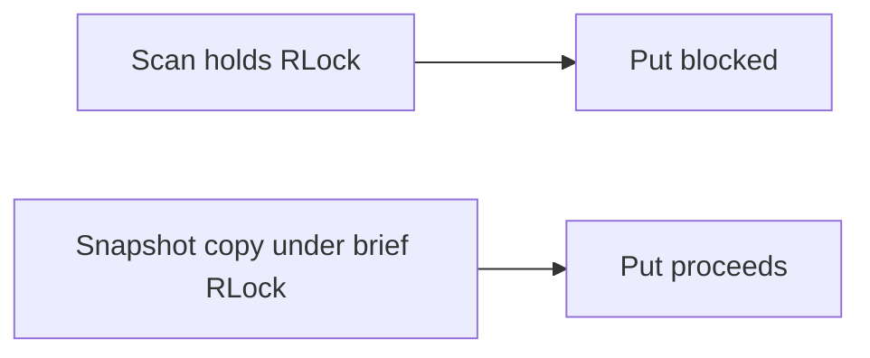

# Context

First `Scan` implementation held locks too long — correct isolation, blocked all writes.

# Original Design

`Scan` created a memtable iterator that held `memtable.mu RLock` for the entire iterator lifetime. Every `Put` needs `Lock` (writer lock). Scans blocked all writes until the client called `Close()`.

# Why I Thought It Was Correct

Holding a read lock gives a stable view of the skip list without copying data. Textbook concurrent data structure usage.

# Failure Symptoms

- `TestScanDoesNotBlockWrites` failed by design — I wrote it after noticing the problem.
- Any long-running scan stalled ingestion completely.
- Benchmarks with concurrent writers + scanners showed write latency spikes to scan duration.

# Investigation

Profiled lock contention; copied memtable snapshot under brief lock (no MVCC needed for point-in-time iterator).

# Root Cause

Iterator lifetime coupled to memtable lock lifetime.

# Fix

I added `memtable.Snapshot()`:

1. Brief `RLock`.
2. Copy level-0 nodes (and tower pointers) into a snapshot structure.
3. `RUnlock`.
4. Iterator walks the copy; writers proceed on the live skip list.

Tradeoff: memory proportional to memtable size at scan creation. Acceptable for my scope; not acceptable for multi-GB memtables without MVCC.

# Verification

- `scan_snapshot_test.go` — `TestScanDoesNotBlockWrites`
- `scan_test.go` — point-in-time semantics

# Takeaways

- Iterator lock scope affects write throughput, not just correctness.
