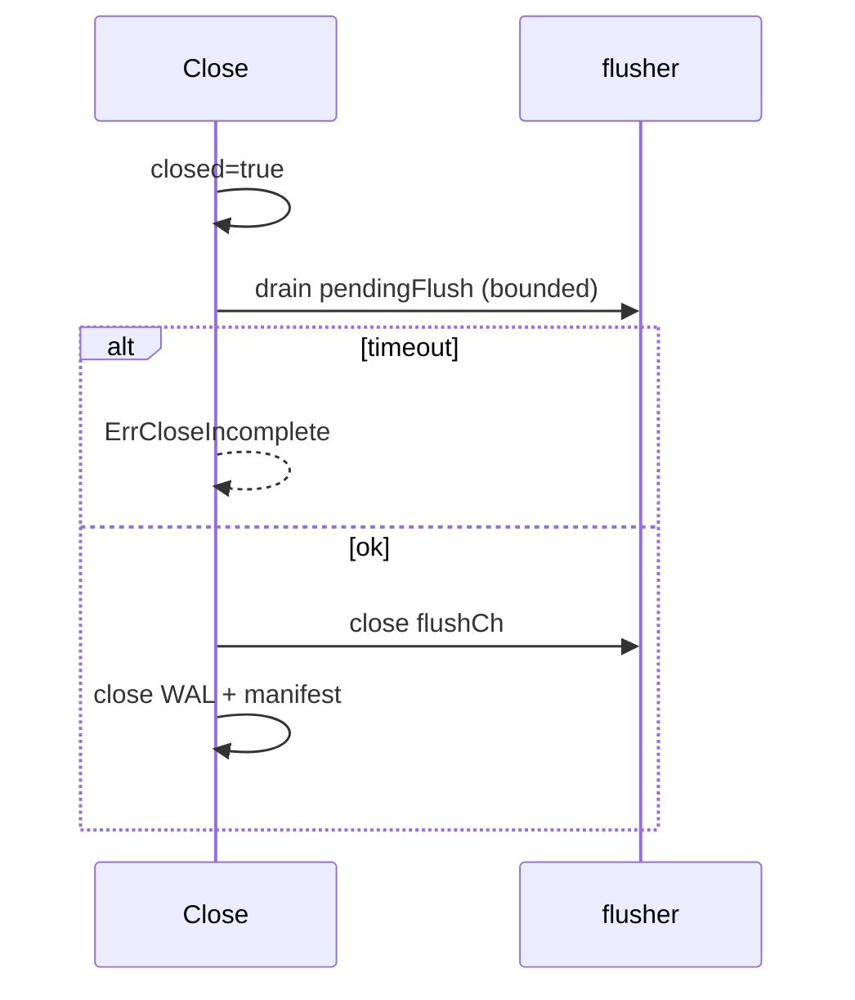

# Context

`Close` must drain pending flushes and stop background workers without hanging forever or tearing down WAL/manifest while goroutines still run. I hit both failure modes.

# Original Design

Early `Close`:

1. Set `closed = true`.
2. Flush active memtable synchronously.
3. Close WAL and manifest immediately.
4. Hope flusher/compactor noticed `closed`.

# Why I Thought It Was Correct

Once `closed` was set, I assumed workers would exit quickly. I did not account for stuck flush (manifest IO hang) or workers blocked on channels.

# Failure Symptoms

- `Close()` blocked indefinitely when flush queue had entries and flusher was retrying errors.
- Race between `Close` nil-ing manifest and flusher still appending.
- `go test` timeout on shutdown tests.
- Incomplete flush during close left DB half-torn-down but `closed` true.

# Investigation

I added timeouts and logging. Commits:
- `1336b21` — Close boundedness, WAL atomicity
- `0a7a5fa` — `ErrCloseIncomplete`, abort path leaves WAL/manifest open
- `505578a` — stop workers on incomplete close

# Root Cause

1. No upper bound on flush drain wait.
2. Resource teardown (WAL/manifest close) happened even when workers were still live.
3. `batchFlusher` and `flusher` needed explicit stop ordering.

# Fix

Current shutdown (`internal/db/close.go`):

1. `closed = true`, stop batch timer.
2. `stopBatchFlusher()` + `flushPendingBatch()`.
3. Loop: queue active to `pendingFlush`, `notifyFlushForce`, `waitForPendingFlushDrain(30s)`.
4. On timeout → `abortClose(ErrCloseIncomplete)` — workers stopped, **WAL/manifest stay open**.
5. Success path: close `flushCh` / `compactCh`, wait `flushDone` / `compactDone` (30s each).
6. `discardAllReaders`, WAL sync+close, manifest close, release `LOCK`.

# Verification

- `close_test.go` — wal size error, stuck flush, wal append failure
- `background_err_test.go` — `TestCloseIncompleteWhenWalSizeFails`

# Lessons Learned

- Shutdown is a state machine, not a destructor.
- Returning an error from `Close` is better than deadlocking or corrupting metadata.
- I release directory `LOCK` in a defer even on incomplete close so the process can exit.
