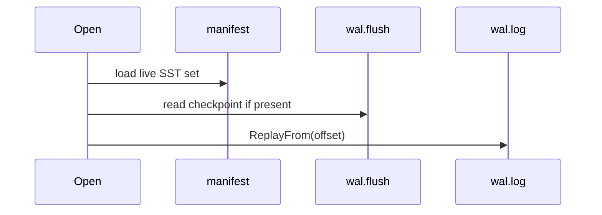

# Context

Early in PebbleDB development I had flush working and SSTables on disk, but `Open` still replayed the **entire** WAL into the active memtable after loading SSTables. I did not notice the bug until integration tests started failing with duplicate keys and stale reads after restart.

# Original Design

Recovery in `Open` looked like this conceptually:

1. Glob or load SST files from disk.
2. Replay **all** WAL records into the active memtable.
3. Start background workers.

I assumed the WAL was the source of truth and replay was always safe.

# Why I Thought It Was Correct

WAL-first durability is the textbook LSM story. If every write is in the WAL, replay should reconstruct state. I had not yet internalized that after flush the same logical records exist in **both** the WAL and an SSTable. Replaying the full WAL re-applied data that was already represented on disk.

# Failure Symptoms

- After restart, `Get` returned values from memtable that **shadowed** older SST data incorrectly.
- Keys flushed to SST appeared twice in internal state (memtable + SST layer).
- Deletes could resurrect if tombstone ordering across layers was wrong.
- Tests around flush + reopen started failing intermittently depending on WAL length.

# Investigation

I traced `Open` and compared it to how RocksDB and LevelDB describe recovery: SSTables are loaded first; WAL replay is a **tail** operation. I added logging of WAL size vs SST contents and realized replay offset was always zero even when `wal.log` contained megabytes already captured in flushed SSTs.

Commit `d0a4a0a` (`fix(lsm): resolve WAL truncation, tombstone visibility, and flush recovery bugs`) is where I fixed truncation and reordered flush durability. Commit `7c420c7` hardened recovery, concurrency, and background errors.

# Root Cause

Two separate mistakes:

1. **Wrong replay scope** — full WAL replay after SST load.
2. **No checkpoint** between manifest commit and WAL truncate — even after I truncated the WAL, I had no durable signal for which byte offset was safe on crash.

# Fix

I introduced `wal.flush` (`internal/db/wal_state.go`):

- Written **after** `manifest.AppendNewFile` succeeds.
- Stores `{FreezeOffset, SSTID}`.
- WAL truncate happens only after this file is fsynced.
- On `Open`, `walReplayStartOffset()` returns:
  - `FreezeOffset` if the SST is in the manifest and WAL size is still ≥ freeze offset.
  - `0` if WAL was truncated below the freeze offset (crash between truncate and removing `wal.flush`).

I also reordered flush so manifest commit is the durability boundary, not WAL cleanup.

# Verification

- `internal/db/wal_state_test.go` — offset edge cases (truncated WAL below freeze, unknown SST id).
- `internal/db/crash_recovery_test.go` — subprocess crash at `flush_after_manifest`, `flush_after_wal_state`, `flush_after_wal_truncate`.
- CI runs `go test -race -shuffle=on ./...` on Linux and macOS.

# Lessons Learned

- Durability boundaries are **specific files at specific times**, not "the WAL exists."
- I now ask on every recovery change: *which bytes are redundant with on-disk SST state?*
- A 16-byte sidecar (`wal.flush`) bought me correct replay semantics without a complex multi-file WAL directory.
