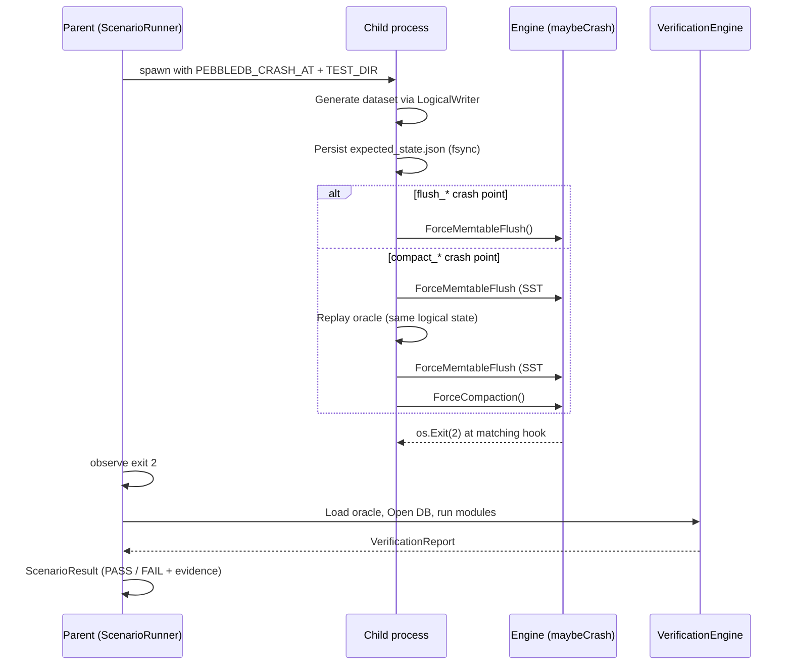
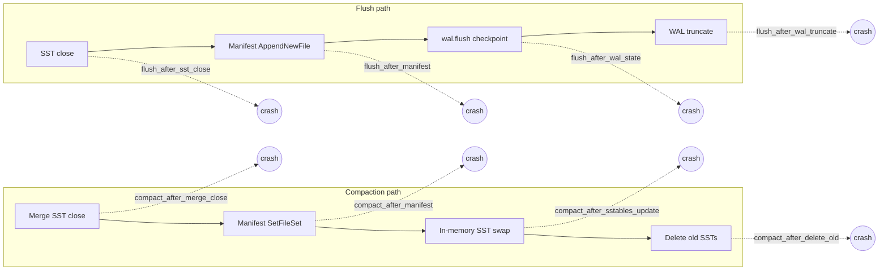
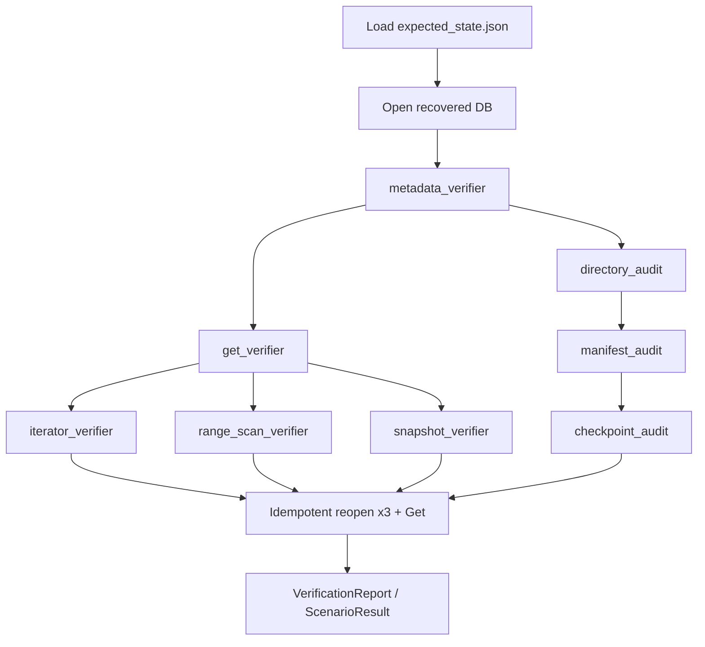
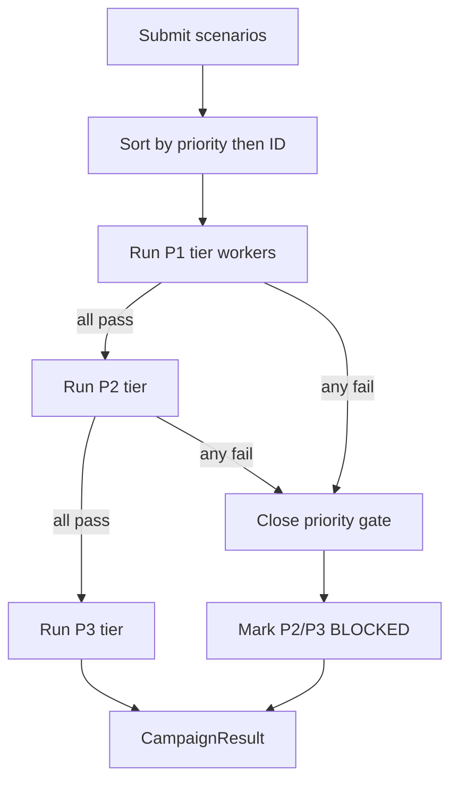
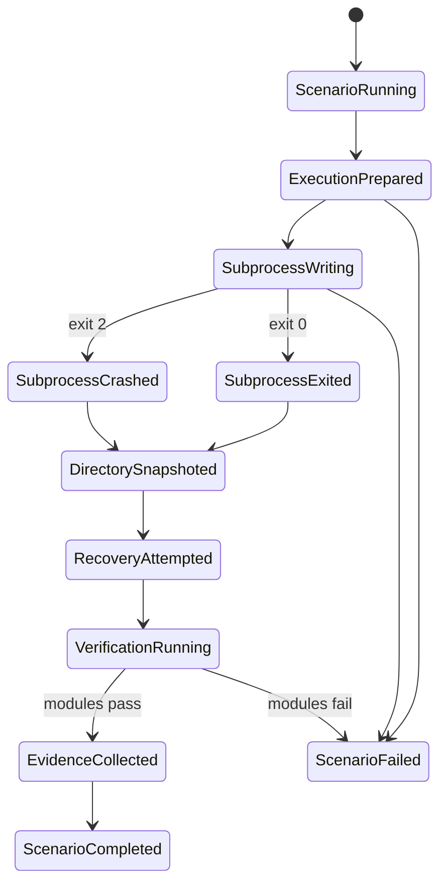

# Acceptance Testing Framework (ATF)

This is the Acceptance Test Driven Development harness for PebbleDB. It does not unit-test individual functions. It kills the process at real flush and compaction boundaries, reopens the directory in a separate parent process, and checks that the recovered database still matches a checksummed oracle written before the crash.

Code lives under `internal/db/acceptance/framework/`. The end-to-end matrix is `TestATFCrashRecoveryMatrix`.

## What a scenario does

The parent process reserves an isolated temp directory, spawns the same test binary as a child (`PEBBLEDB_CHILD_PROCESS=1`), and waits for either a clean exit or exit code 2 (intentional crash). The child writes a deterministic keyspace, persists `expected_state.json` with an fsynced SHA-256 checksum, then drives the engine toward the requested `PEBBLEDB_CRASH_AT` hook. After the child dies, the parent loads the oracle, opens the directory, runs every verifier module, and only reports PASS when all of them succeed. Failed runs keep the directory when artifact retention is on, and can zip it into an evidence bundle.



## Crash matrix

Eight engine hooks in `internal/db/crashpoint.go` are registered in `crash/builtins.go` and exercised by the ATF matrix. Flush hooks fire inside `ForceMemtableFlush`. Compaction hooks need two live SSTables and a compaction threshold of 2; the child gets there by flushing once, replaying the oracle (Puts/Deletes that leave logical state unchanged), flushing again, then calling `ForceCompaction()`.

| ID | Engine hook (`PEBBLEDB_CRASH_AT`) | Phase | How the child reaches it |
|----|----------------------------------|-------|--------------------------|
| EXS-012 | `flush_after_sst_close` | Flush | ForceMemtableFlush |
| EXS-010 | `flush_after_manifest` | Flush | ForceMemtableFlush |
| EXS-011 | `flush_after_wal_state` | Flush | ForceMemtableFlush |
| EXS-013 | `flush_after_wal_truncate` | Flush | ForceMemtableFlush |
| EXS-014 | `compact_after_merge_close` | Compaction | replay + ForceCompaction |
| EXS-015 | `compact_after_manifest` | Compaction | replay + ForceCompaction |
| EXS-016 | `compact_after_sstables_update` | Compaction | replay + ForceCompaction |
| EXS-017 | `compact_after_delete_old` | Compaction | replay + ForceCompaction |



Crash selection is not a raw env string stuck into the child by accident. `crash.Manager` resolves the scenario crash point against the builtin registry, applies an Always policy for ATF runs, and hands `SubprocessController` the `EngineHook` string for `PEBBLEDB_CRASH_AT`.

## Oracle and dataset

`dataset.SequentialGenerator` builds a fixed keyspace from seed, key count, overwrite count, and tombstone stride. Every Put/Delete updates an in-memory `MapExpectedState`. Before any crash hook runs, that state is written to `expected_state.json` with `schema_version`, scenario/execution IDs, and a checksum over the payload (checksum field itself excluded). On the parent side, `OracleLoader` refuses missing files, bad schema versions, and checksum mismatches. That file is the ground truth for every logical verifier.

| Child env var | Role |
|---------------|------|
| `PEBBLEDB_CHILD_PROCESS=1` | Enter child main from test `init` |
| `PEBBLEDB_TEST_DIR` | Database directory |
| `PEBBLEDB_SCENARIO_ID` / `PEBBLEDB_EXECUTION_ID` | Written into the oracle |
| `PEBBLEDB_CRASH_AT` | Engine hook string |
| `PEBBLEDB_MEMTABLE_SIZE` | Memtable size in bytes |
| `PEBBLEDB_COMPACTION_THRESHOLD` | Set to `2` for compaction scenarios |
| `PEBBLEDB_SEED` / `PEBBLEDB_KEY_COUNT` | Dataset shape |
| `PEBBLEDB_OVERWRITE_COUNT` / `PEBBLEDB_TOMBSTONE_EVERY` | Overwrites and deletes |
| `PEBBLEDB_FORCE_FLUSH` | `0` skips forced flush; default forces it |
| `PEBBLEDB_SYNC_WRITES` | Sync-on-write option |

## Verification

After recovery the parent opens the directory with compaction disabled (`CompactionThreshold: -1`) so background work does not race the checks. Modules run through `VerificationEngine`. Default registration order is metadata → get → iterator → range scan → snapshot → directory audit → manifest audit → checkpoint audit. Scenarios can also declare a `verification_dag`; the engine topologically sorts registered modules (Kahn), skips a module when a dependency already failed, ignores unknown names, and errors on cycles.



| Module | Kind | What it checks |
|--------|------|----------------|
| `metadata_verifier` | Logical / gate | Clean open, no background error, oracle live+tombstone partition, recovered live count equals oracle |
| `get_verifier` | Logical | Every oracle key: live values exact, tombstones return `ErrNotFound` |
| `iterator_verifier` | Logical | Full forward scan order/uniqueness/boundaries; Seek to each live key |
| `range_scan_verifier` | Logical | Full, partial, tail, and prefix scans vs oracle live set |
| `snapshot_verifier` | Logical | Two concurrent scans agree; Get matches scan values; tombstones absent |
| `directory_audit` | Structural | Manifest live IDs match on-disk `sst_*.sst`; no orphans left in the live dir |
| `manifest_audit` | Structural | CURRENT → MANIFEST resolves, replays cleanly, live IDs unique/sorted, SST files non-empty |
| `checkpoint_audit` | Structural | `wal.flush` absent or exactly 16 bytes; freeze offset sane; SST id cross-checked |

The runner projects the report into `types.VerificationOutcome` on `ScenarioResult` (module summaries, failures, abort reason) so campaign reports stay useful without leaking the verifier package into the types leaf.

## Campaigns and scheduling

`CampaignScheduler` takes submitted scenarios, sorts them by priority then ID, and runs them with `Execute`. Same-priority scenarios share a tier and run with bounded concurrency (`workersCount`). Each scenario gets a fresh executor from an `ExecutorFactory` so crash-manager state is not shared across goroutines. Failures retry up to `maxRetries`. If anything in a tier fails, lower-priority tiers are marked `BLOCKED` and never run (priority gate). Results fold into a `CampaignResult` with pass / fail / blocked counts.



## Evidence on failure

When the runner has an `evidence.Collector`, a failed scenario produces a zip under the collector base dir: `<scenario>_<execution>_<timestamp>.zip`. Inside are `atf_report.json` (scenario id, execution result, full verification report) and a snapshot of the recovered directory tree when it still exists. The zip path is stored on `ScenarioResult.EvidencePath`, and the event bus gets `EventEvidenceZipped`.

## Lifecycle states

The session tracker walks a fixed state machine for each scenario. Illegal transitions fail the run rather than silently continuing.



## Packages in the framework

| Package | Responsibility |
|---------|----------------|
| `types` | Scenario/campaign models, lifecycle states, verification outcome leaf types |
| `dataset` | Deterministic generator + oracle persist/load |
| `crash` | Registry, builtins, Manager, policies, child env for `PEBBLEDB_CRASH_AT` |
| `runner` | ScenarioRunner, subprocess spawn, child main, ForceFlush / ForceCompaction drive |
| `verifier` | Engine, DAG order, logical modules, structural audits, oracle loader |
| `scheduler` | Campaign ordering, workers, retries, priority gate |
| `evidence` | Zip packaging of failed dirs + reports |
| `resource` | CPU/memory/FD budgets, temp dirs, retain-on-fail |
| `session` | Scenario and campaign state machines |
| `config` / `registry` / `eventbus` / `telemetry` / `logging` | Config merge, scenario registry, events, metrics, logs |

## CI

The main CI job still runs the full suite with `-race` and `-shuffle=on`. A separate job, `atf-crash-recovery`, runs on ubuntu and macos:

1. `go test -race -count=1 -v -run TestATFCrashRecoveryMatrix ./internal/db/acceptance/framework/`
2. `go test -race -count=1 ./internal/db/acceptance/...`

That job exists so a recovery regression shows up under its own name instead of disappearing into the full matrix.

## Pass criteria

A scenario passes only when the child exited 2 at the requested crash point, the parent reopened the directory cleanly, every logical and structural module passed (or was skipped only because a dependency already failed — and then the run is still FAIL), and three idempotent reopen+Get cycles agreed with the oracle. Anything else is FAIL, with the temp directory and optional evidence zip left behind for debugging.

## How to run it locally

```bash
go test ./internal/db/acceptance/framework/ -run TestATFCrashRecoveryMatrix -v -count=1
go test ./internal/db/acceptance/... -race -count=1
```
