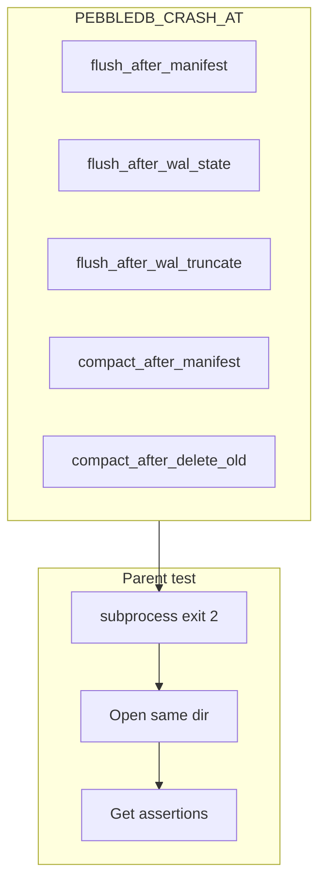

# Crash testing

I test crash recovery by **actually exiting** the process at known points — not by calling `Close()` and hoping.

## Mechanism

`internal/db/crashpoint.go` checks `PEBBLEDB_CRASH_AT` and calls `os.Exit(2)`.

Parent test (`crash_recovery_test.go`):

1. `exec` same test binary with env vars set.
2. Expect exit code 2.
3. `Open` same directory in parent.
4. Assert keys / manifest state.



## Crash points

| Value | After |
|-------|-------|
| `flush_after_manifest` | `AppendNewFile` fsync |
| `flush_after_wal_state` | `wal.flush` written |
| `flush_after_wal_truncate` | WAL truncated |
| `compact_after_manifest` | compaction `SetFileSet` |
| `compact_after_delete_old` | old SST files deleted |

## Why subprocess

In-process panic does not test `Open` recovery code the same way — file handles, buffer cache, and worker goroutines differ.

## Running

```bash
go test ./internal/db -run Crash -v
```

## Limitations I accept

- Does not simulate partial disk writes (no LD_PRELOAD fault injection)
- Does not test power loss mid-fsync
- Single-machine, single-process focus
