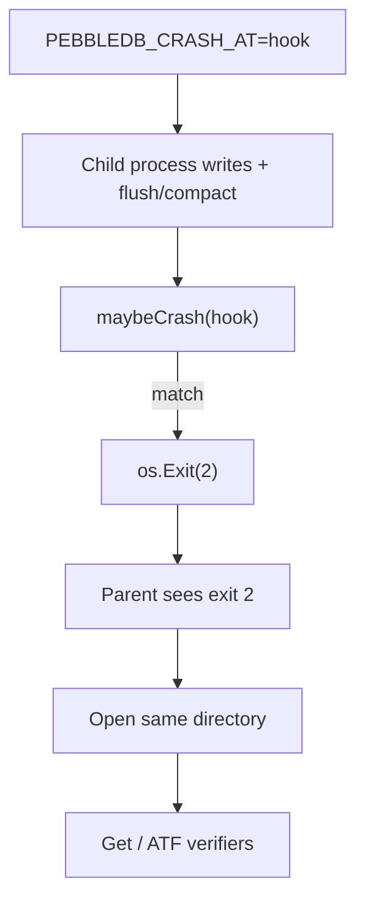

# Crash testing

Crash recovery is tested by actually exiting the process at known points in flush and compaction, not by calling `Close()` and hoping the same code paths run. There are two layers: low-level subprocess tests in `internal/db`, and the Acceptance Testing Framework that wraps the same hooks with an oracle and multi-module verification. For the ATF picture see [ATF.md](ATF.md).

## Mechanism

`internal/db/crashpoint.go` compares `PEBBLEDB_CRASH_AT` to a named hook and calls `os.Exit(2)`. Parent tests spawn the same binary with that env set, expect exit code 2, reopen the directory, and assert.



## Engine hooks

All eight hooks below are wired in the engine and covered by `TestATFCrashRecoveryMatrix`.

| Hook | Where it fires | Driver in ATF child |
|------|----------------|---------------------|
| `flush_after_sst_close` | After flush SST writer Close | ForceMemtableFlush |
| `flush_after_manifest` | After manifest AppendNewFile | ForceMemtableFlush |
| `flush_after_wal_state` | After wal.flush checkpoint written | ForceMemtableFlush |
| `flush_after_wal_truncate` | After WAL TruncateBefore | ForceMemtableFlush |
| `compact_after_merge_close` | After compaction merge SST Close | ForceCompaction |
| `compact_after_manifest` | After compaction SetFileSet | ForceCompaction |
| `compact_after_sstables_update` | After in-memory SST list swap | ForceCompaction |
| `compact_after_delete_old` | After Discard of old SSTs | ForceCompaction |

`ForceCompaction` is exported on `*db.DB` for acceptance tests. It holds `compactMu` and runs one `doCompaction` cycle so compaction crashes do not depend on background timer luck.

## Why a subprocess

In-process panic does not exercise recovery the same way. File handles, buffer cache, and worker goroutines look different after a real process death. The ATF child also clears `PEBBLEDB_CRASH_AT` before `Close()` so a shutdown flush cannot re-trigger the hook after a surviving path.

## Running

```bash
# Low-level crash recovery tests in the db package
go test ./internal/db -run Crash -v -count=1

# Full ATF matrix (oracle + all verifiers)
go test ./internal/db/acceptance/framework/ -run TestATFCrashRecoveryMatrix -v -count=1
```

## What this does not cover

These tests do not inject partial sector writes or power loss mid-fsync. They kill the whole process at the named durability boundaries and prove reopen + logical/structural consistency from that disk state.
