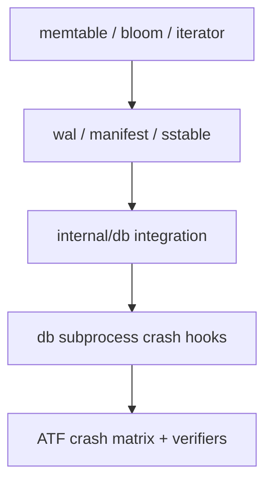

# Testing strategy

I test PebbleDB in layers because storage bugs hide at integration boundaries. Unit tests catch data-structure mistakes; crash and acceptance tests catch durability ordering mistakes.

## Pyramid



| Layer | Where | What it proves |
|-------|-------|----------------|
| Unit | `memtable`, `bloom`, `iterator` | Data structure invariants |
| Storage | `wal`, `manifest`, `sstable` | On-disk format and salvage |
| Integration | `internal/db` | Open, flush, compaction, recovery |
| Crash hooks | `internal/db` subprocess | Durability at each `PEBBLEDB_CRASH_AT` boundary |
| ATF | `internal/db/acceptance/framework` | Oracle-backed write → crash → reopen → multi-module verify |
| Race | all with `-race` | Concurrent access bugs |

ATF details and the eight-hook matrix are in [ATF.md](ATF.md). Low-level crash spawn mechanics are in [CRASH_TESTING.md](CRASH_TESTING.md).

## What I run locally

```bash
go test ./...
go test ./... -race
go test ./internal/db -run Crash -v -count=1
go test ./internal/db/acceptance/framework/ -run TestATFCrashRecoveryMatrix -v -count=1
```

## What CI runs

From `.github/workflows/ci.yml`:

| Job | Platforms | Commands |
|-----|-----------|----------|
| `ci` | ubuntu, macos | `go mod tidy -diff`, `go vet`, build CLI, `golangci-lint`, `go test -race -count=1 -shuffle=on` |
| `atf-crash-recovery` | ubuntu, macos | ATF crash matrix + `go test -race ./internal/db/acceptance/...` |

Test cache is disabled in CI (`-count=1`) because WAL/manifest truncation bugs have hidden behind cached passes. Windows is not in the matrix: rename-with-open-handle races on `windows-latest` produced false reds.

## Coverage philosophy

High coverage in `internal/db` matters more than chasing 100% in `bloom`. Paths that touch durability ordering come first.

## Test naming

Integration tests name the invariant, for example `TestWalReplayStartOffsetWhenWalTruncatedBelowFreeze`, `TestManifestIgnoresOrphanSSTAfterCompactionCrash`, `TestGetSurvivesCompactionWithHeldRefs`. If the name is vague, the test is usually weak.
